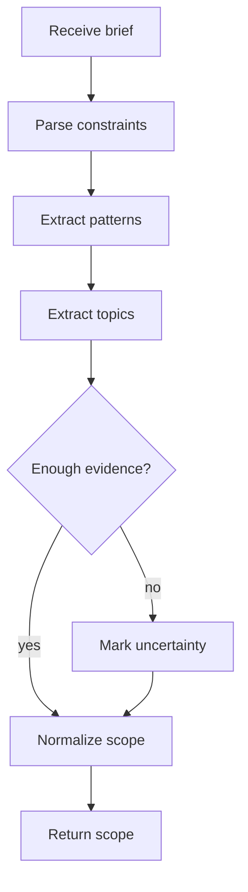

# projectSpecIntakeService.js

- Source: `Backend/src/services/projectSpecIntakeService.js`
- Kind: JavaScript service

## Story
### What Happens Here

This service turns a project manager's natural-language brief into a structured learning scope. It pulls out the architectural requirements, business-process constraints, and the structural design patterns the intern actually needs to study.

This is the first narrowing stage in the workflow. The output should be project-specific, not catalog-wide.

### Why It Matters In The Flow

The AI prompt from the project manager is intentionally broad. This service makes it actionable by converting the prompt into a deterministic scope that the rest of the system can use.

### What To Watch While Reading

Keep extraction disciplined:
- the service should not invent patterns that were not supported by the brief.
- the service should separate required patterns from optional background topics.
- the service should surface uncertainty instead of silently broadening the scope.

## Service Flow



## Input Contract

```json
{
  "projectId": "proj-1024",
  "projectTitle": "Retail billing redesign",
  "businessSpecs": [
    "support rule-based billing",
    "keep workflow auditable"
  ],
  "architectureSpecs": [
    "favor structural patterns where they reduce coupling",
    "keep UI and policy separated"
  ],
  "businessProcess": "Project manager describes the business and the AI returns only the required structural topics."
}
```

## Output Contract

```json
{
  "projectId": "proj-1024",
  "scopeVersion": "scope-7",
  "requiredPatterns": ["adapter", "facade"],
  "requiredTopics": ["module boundaries", "dependency direction"],
  "excludedPatterns": ["builder", "singleton"],
  "confidence": "medium",
  "status": "normalized"
}
```

## Acceptance Checks

- The service can return a scope even when the brief is written in business language rather than pattern names.
- The service does not expand the project into the full design-pattern catalog.
- The service keeps required and excluded patterns separate.
- The service can flag uncertainty without stopping the workflow.
