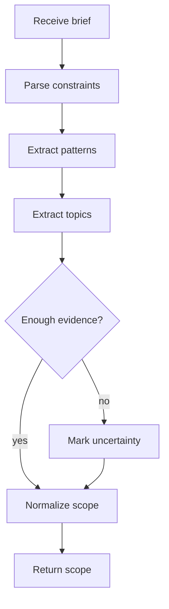

# projectSpecIntakeService.js

- Source: `Backend/src/services/projectSpecIntakeService.js`
- Kind: JavaScript service

## Story
### What Happens Here

This service turns a project manager's natural-language brief into a structured learning scope. It scores the brief against the shared business-pattern guide, then pulls out the architectural requirements, business-process constraints, and the structural design patterns the intern actually needs to study.

This is the first narrowing stage in the workflow. The output should be project-specific, not catalog-wide.

The shared cue map, tokenization, and evidence scoring now come from `patternEvidenceService.ts` so the intake stage uses the same pattern language as the course planner.

### Why It Matters In The Flow

The AI prompt from the project manager is intentionally broad. This service makes it actionable by converting the prompt into a deterministic scope that the rest of the system can use.

The project orchestration API surface is pinned by `docs/Codebase/Backend/src/__tests__/projectLearningOrchestration.test.ts.md`, which keeps the scope, toggle, and assessment path deterministic for a Devcon-style student delegation brief.

### What To Watch While Reading

Keep extraction disciplined:
- the service should not invent patterns that were not supported by the brief.
- the service should separate required patterns from optional background topics.
- the service should surface uncertainty instead of silently broadening the scope.
- the service should allow several distinct patterns when each one reflects a different business force.
- the selector should consider the full pattern catalog, not a small hand-picked subset.
- the selector should stay low-confidence or empty on vague briefs instead of forcing an Adapter-shaped answer.
- the cue vocabulary and evidence scoring should stay in sync with the planner through the shared helper.

## Service Flow



## Input Contract

```json
{
  "projectId": "proj-1024",
  "projectTitle": "Retail billing redesign",
  "businessSpecs": [
    "support rule-based billing",
    "keep workflow auditable"
  ],
  "architectureSpecs": [
    "favor structural patterns where they reduce coupling",
    "keep UI and policy separated"
  ],
  "businessProcess": "Project manager describes the business and the AI returns only the required structural topics."
}
```

## Output Contract

```json
{
  "projectId": "proj-1024",
  "scopeVersion": "scope-7",
  "requiredPatterns": ["adapter", "facade", "observer", "command", "strategy"],
  "requiredTopics": ["compatibility layer", "single front door", "live updates", "queued actions", "policy variation"],
  "excludedPatterns": ["builder", "singleton"],
  "confidence": "high",
  "status": "normalized"
}
```

## Acceptance Checks

- The service can return a scope even when the brief is written in business language rather than pattern names.
- The service does not expand the project into the full design-pattern catalog.
- The service keeps required and excluded patterns separate.
- The service can flag uncertainty without stopping the workflow.
- The service can infer multiple distinct patterns from one brief when the business forces are separate.
- The selector does not require a cue match before a pattern can be considered.
- Devcon-style briefs can resolve to command, observer, repository, state, and strategy without collapsing to Adapter.
- Vague briefs remain low confidence instead of being forced into the top-ranked pattern.
- The cue vocabulary and shared scoring helper live in `patternEvidenceService.ts`.
