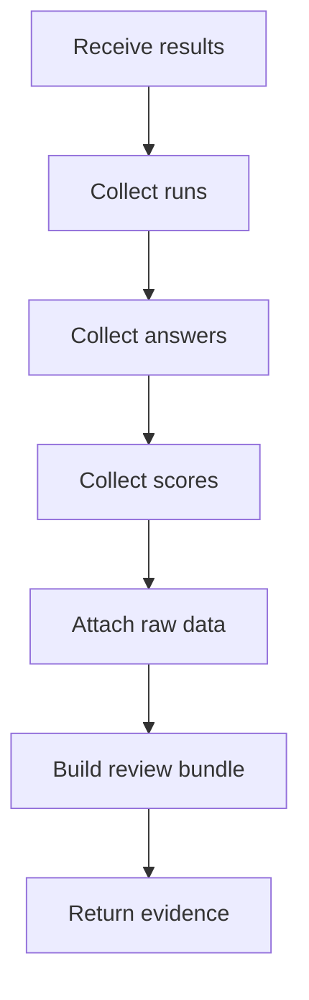

# readinessEvidenceService.js

- Source: `Backend/src/services/readinessEvidenceService.js`
- Kind: JavaScript service

## Story
### What Happens Here

This service packages the proof that the project manager needs for review. It collects code runs, theoretical answers, exam results, raw result data, and any derived readiness signal into a reviewable evidence bundle.

The PM is getting a suggestion tool, not a blind verdict. This service keeps the evidence visible so a human can audit the recommendation.
It should also keep a short local retention window for recent runs. The default review store should preserve the latest 150 runs locally, and the PM should be able to download a spreadsheet export that includes response rows, log rows, and raw performance measurements such as elapsed time, CPU-like timing, and space usage when those metrics are captured.

### Why It Matters In The Flow

The last stage of the workflow is trust and review. If the system says an intern is ready, the PM should still be able to inspect the supporting data.

### What To Watch While Reading

Keep summary and raw evidence together:
- summary status tells the PM where to look.
- raw data lets the PM verify the system's judgment.
- the service should not erase the intern's original answers or code-run traces.

## Service Flow



## Input Contract

```json
{
  "projectId": "proj-1024",
  "internId": "int-44",
  "moduleId": "adapter",
  "codeRuns": [],
  "answers": [],
  "scores": [],
  "rawResults": [],
  "performanceMetrics": [],
  "logs": []
}
```

## Output Contract

```json
{
  "projectId": "proj-1024",
  "internId": "int-44",
  "summaryStatus": "ready",
  "evidenceRef": "ev-9012",
  "codeRuns": [],
  "answers": [],
  "scores": [],
  "rawResults": [],
  "exports": [
    {
      "type": "xlsx",
      "name": "readiness-audit.xlsx"
    },
    {
      "type": "csv",
      "name": "readiness-audit.csv"
    }
  ]
}
```

## Acceptance Checks

- The PM review package includes summary status and raw evidence side by side.
- The service keeps code runs and exam answers available for audit.
- The service can support a suggestion-based review without hiding the underlying data.
- The service preserves the original result data instead of collapsing it into a single opaque score.
- The service can retain the latest 150 runs locally for quick review.
- The PM can download spreadsheet exports with response rows, logs, and raw performance data.
