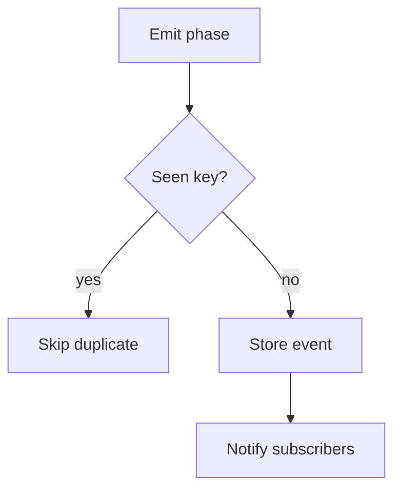

# runEventsStore.ts

- Source: `Backend/src/services/runEventsStore.ts`
- Kind: in-memory SSE event store

## Story
This store buffers run events until the frontend subscribes. The dedupe key now includes `wrapperId`, so a retry can replay safely without merging two different question instances into one stream row.

## Read Order
1. `reserveRun()` and `findActiveRunFor()` for ownership and active-run gating.
2. `pushPhaseEvent()` for the dedupe key.
3. `subscribeRun()` for replay and SSE delivery.

## Flow

## Boundary
- The store owns in-memory replay only.
- It does not know about pods, compilation, or UI grouping.
- Wrapper identity is part of the event key, but the store still falls back to pattern/class for compatibility.

## Acceptance Checks
- Duplicate wrapper events do not emit twice.
- A second active run for the same user is still blocked.
- Replays stay bounded by the existing TTL.
