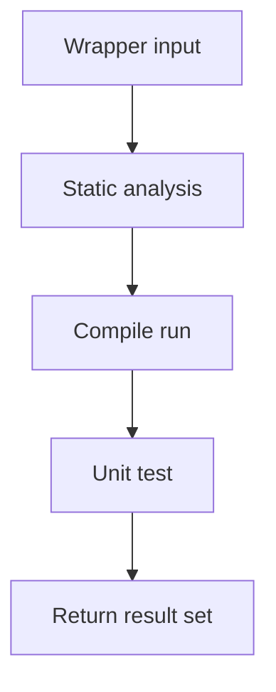

# testRunnerService.ts

- Source: `Backend/src/services/testRunnerService.ts`
- Kind: backend test execution service

## Story
This service builds and runs the test phases for one wrapper instance at a time. The wrapper shares the caller's pod when pod mode is enabled, but it still gets its own scratch directory and its own result identity so the UI can keep per-question runs separate.

## Read Order
1. `runPhase()` for the shared compile/run wrapper logic.
2. `runStaticAnalysis()`, `runSubmissionCompile()`, and `runPatternUnitTest()` for the phase-specific entry points.
3. `runPatternTest()` for the single-wrapper sequential phase flow.

## Flow

## Boundary
- One pod per user stays in `podManager.ts`.
- One wrapper id travels through the service so the same pattern/class can be retried without collapsing into a shared row.
- Scratch directories are still per phase so the binaries and files do not collide on disk.

## Acceptance Checks
- Every phase result carries the wrapper id.
- A missing template still returns a unit-test result tagged with the same wrapper id.
- The service does not try to create a pod per question.
