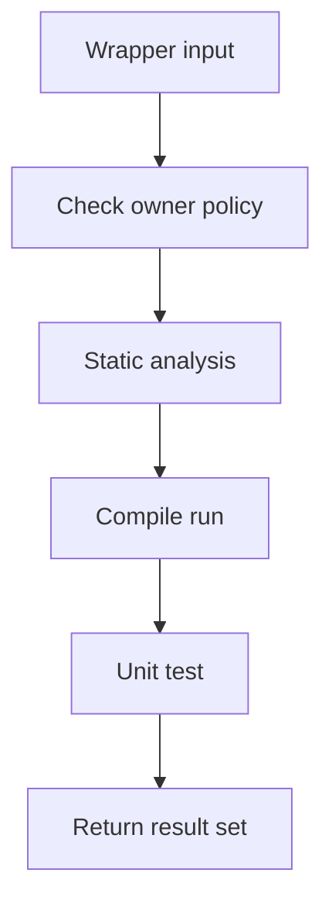

# testRunnerService.ts

- Source: `Backend/src/services/testRunnerService.ts`
- Kind: backend test execution service

## Story
This service builds and runs the test phases for one wrapper instance at a time. The wrapper shares the caller's pod only when the wrapper plan marks it as owner-shared, but it still gets its own scratch directory and its own result identity so the UI can keep per-question runs separate.

## Read Order
1. `runPhase()` for the shared compile/run wrapper logic.
2. `runStaticAnalysis()`, `runSubmissionCompile()`, and `runPatternUnitTest()` for the phase-specific entry points.
3. `runPatternTest()` for the single-wrapper sequential phase flow.

## Flow

## Boundary
- One pod per user stays in `podManager.ts`.
- One wrapper id travels through the service so the same pattern/class can be retried without collapsing into a shared row.
- `wrapperOwnerKey` and `wrapperSharesDocker` travel with every phase result; pod reuse is attempted only when `wrapperSharesDocker` is true and a `userId` is present.
- Scratch directories are still per phase so the binaries and files do not collide on disk.
- Compile and unit-test binaries include a sanitized wrapper suffix when a wrapper id is present. This keeps timeout cleanup in a shared user pod from killing a sibling wrapper that is still running.

## Acceptance Checks
- Every phase result carries the wrapper id.
- Every phase result carries the wrapper owner policy.
- A missing template still returns a unit-test result tagged with the same wrapper id.
- The service does not try to create a pod per question; owner-shared wrappers reuse the user's pod.
- Wrapper-owned binary names are unique enough for pod-side timeout cleanup to target one wrapper.
