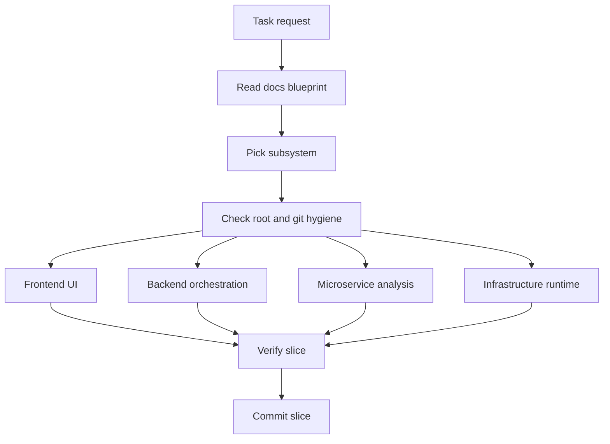

# Clean Code Architecture Plan

- Source of truth: `docs/Codebase`
- Audience: GPT-5.5 xhigh for planning, GPT-5.4 mini with medium context for implementation slices
- Rule: this plan is an execution contract, not a rewrite invitation

## Goal

Make the repository easier for a smaller model to modify safely by giving it stable boundaries, names, read order, slice rules, docs architecture, root hygiene, and Git hygiene. The model should work one subsystem at a time, preserve current behavior, and verify every slice before moving on.

The target architecture is not "new framework everywhere." It is the current NeoTerritory shape made stricter:

- Frontend renders and manages UI workflows.
- Backend owns HTTP, storage, orchestration, AI provider calls, and admin policy.
- Microservice owns deterministic C++ analysis only.
- Infrastructure owns local/runtime/container setup.
- Docs mirror the intended code structure and explain future movement before code moves.
- The repository root stays lean: source, docs, manifests, and deliberate fixtures stay visible; generated output, caches, scratch files, and secrets stay out.
- Git hygiene is part of architecture: tracked source and blueprint files are intentional, while local artifacts and machine-specific files remain untracked.

## Repo Map



## Architecture Boundaries

### Docs Architecture

Owns:
- `docs/Codebase` as the blueprint mirror for current or planned implementation paths.
- Folder `README.md` files that state read order, ownership, and out-of-scope material.
- File-level markdown mirrors that explain the local file, function, or bounded subsystem.
- Mermaid diagrams that stay local to the documented unit and use short labels.

Does not own:
- ad hoc design notes that do not map to code or a blueprint boundary.
- documentation-only support folders that would pollute the future code structure.
- generated output or build artifacts disguised as docs.

Clean shape:
- Each major subsystem folder has a `README.md`.
- Each major module folder has a `README.md` when a reader needs a starting point.
- File docs mirror source paths with `.md` appended.
- Docs describe ownership first, implementation detail second.

### Frontend

Owns:
- React screens, panels, tabs, forms, and local UI state.
- API client calls through `src/api/client.ts`.
- Browser-only workflow logic under `src/logic`.
- UI type declarations under `src/types`.
- CSS namespaces for admin, learning, marketing, and analysis surfaces.

Does not own:
- SQL or persistence rules.
- AI prompt assembly.
- pattern detection or ranking truth.
- microservice output layout.
- server authorization decisions.

Clean shape:
- Components render data and call typed API functions.
- Pure UI transformations live in `src/logic`.
- Shared wire contracts live in `src/types/api.ts`.
- Admin surfaces use `*Tab.tsx`, `*Panel.tsx`, or `*Dashboard.tsx` names based on role.

### Backend

Owns:
- Express server bootstrap and middleware.
- Route parsing, validation, status codes, and response shape.
- Business orchestration in services.
- SQLite source of truth and Supabase mirror calls.
- AI provider adapters and prompt construction.
- Admin analytics and export endpoints.

Does not own:
- React rendering decisions.
- C++ structural matching algorithms.
- generated frontend bundles.
- direct browser state.

Clean shape:
- `routes/` handles HTTP and calls services.
- `services/` handles business flow and integration orchestration.
- `db/` handles schema, SQL statements, and row persistence helpers.
- `validation/` owns request schemas when payload validation is non-trivial.
- `types/` owns API and DB type contracts that are shared across backend modules.
- Tests sit near the behavior they protect under `src/__tests__`.

### Microservice

Owns:
- deterministic C++ source analysis.
- pattern catalog loading.
- token/tree processing.
- structural reports and evidence output.
- compile-time and runtime layout for the analyzer.

Does not own:
- AI provider calls.
- database writes.
- HTTP routing.
- frontend presentation.
- admin policy.

Clean shape:
- `Modules/Source/Analysis` owns input and pattern analysis.
- `Modules/Source/Trees` owns parse tree construction and generated tree views.
- `Modules/Source/OutputGeneration` owns report/test output production.
- `Modules/Header` mirrors public C++ contracts.
- `pattern_catalog` stays data-driven.

### Infrastructure

Owns:
- local runtime setup.
- container/session orchestration.
- CI flow docs.
- bootstrap scripts.

Does not own:
- business logic.
- frontend component behavior.
- backend route contracts.
- C++ detection rules.

Clean shape:
- Scripts are entrypoint wrappers around explicit stages.
- Runtime layout rules live under `Infrastructure/runtime-layout`.
- Session orchestration stays under `Infrastructure/session-orchestration`.

### Root Hygiene

Owns:
- the shape of the repository root.
- the small set of root-level files that act as entrypoints or manifests.
- the decision to keep generated output and scratch files out of the root.

Does not own:
- module implementation files that belong under `Backend`, `Frontend`, `Microservice`, or `Infrastructure`.
- temporary notes, local experiments, downloaded archives, or hidden work files.

Clean shape:
- Root-level files should be intentional and few.
- Generated folders and machine-local debris stay in ignored or local-only locations.
- New top-level files should be rare and justified by cross-repo ownership.

### Git Hygiene

Owns:
- tracked versus untracked policy for source, docs, fixtures, and generated artifacts.
- local scratch files, secrets, cache directories, and editor state.
- cleanup discipline for accidentally tracked build output.

Does not own:
- business behavior or feature logic.
- source edits outside the hygiene boundaries above.

Clean shape:
- Source, manifests, lockfiles, blueprint docs, and deliberate fixtures are tracked.
- Build output, dependency caches, runtime logs, temporary exports, scratch files, and sensitive local files stay untracked.
- Tracked generated artifacts are exceptional and should be called out explicitly when they must exist.

## Naming Rules

### Global

- Use names that describe the business or algorithm stage before the implementation pattern.
- Do not name a folder after a design pattern unless the folder is genuinely a pattern catalog or pattern-family boundary.
- Prefer one obvious owner for every concept. Do not duplicate names across frontend, backend, and microservice unless they are wire contracts.
- Avoid generic names such as `helper`, `manager`, `utils`, `common`, `misc`, `data`, or `core` unless the surrounding folder makes the role precise.
- New docs must mirror current or planned code paths. Do not create docs-only support folders.

### Backend TypeScript

- Files: `camelCase.ts`.
- Service files: `<domain><Role>Service.ts`, for example `coursePlannerService.ts`.
- Route files: route domain name, for example `admin.ts`, `analysis.ts`.
- DB files: storage subject, for example `aiConfig.ts`, `database.ts`.
- Tests: `<unit>.test.ts`.
- Functions and variables: `camelCase`.
- Types and interfaces: `PascalCase`.
- Constants: `SCREAMING_SNAKE_CASE` for environment/config constants; `PascalCase` or descriptive `camelCase` for local maps only when existing style requires it.
- API route paths: lowercase kebab or existing admin path convention.
- DB tables and columns: `snake_case`.
- JSON keys for API payloads: `camelCase`.

### Frontend TypeScript / React

- Components: `PascalCase.tsx`.
- Component names must match file names.
- Hooks: `useThing.ts`.
- Logic modules: `camelCase.ts`.
- API client functions: verb-first names, for example `fetchAdminComplexityData`, `previewCoursePlan`.
- CSS classes: existing namespace first, for example `admin-*`, `nt-*`, `courses-*`.
- Avoid new broad wrapper components named `Container`, `Wrapper`, or `Section` unless the component has a domain-specific role.

### C++ Microservice

- Folders: logic-first `PascalCase` where the existing tree uses it.
- Source/header files: `snake_case.cpp` and `snake_case.hpp`.
- Entry files may remain `core.cpp` or `core.hpp` only when the folder already names the unit precisely.
- Functions: `snake_case`.
- Types/classes: `PascalCase`.
- Constants: follow existing C++ local convention, but prefer clearly scoped constants.
- Pattern catalog files: lowercase pattern names in the existing catalog layout.

### Docs

- File docs mirror source paths with `.md` appended.
- Folder `README.md` explains read order, ownership boundary, and what belongs outside that folder.
- Durable design decisions go in `docs/Codebase/DESIGN_DECISIONS.md`.
- File-level docs should show local flow only, not the whole system.
- Mermaid diagrams must use short node labels and stay local to the documented unit.
- Docs for root hygiene or Git hygiene should describe policy, not cleanup history, unless the cleanup itself is the intended deliverable.

## Small-Model Execution Contract

Use this contract when handing a task to GPT-5.4 mini with medium context.

```text
You are editing NeoTerritory. Read docs/Codebase/CLEAN_CODE_ARCHITECTURE_PLAN.md first.
Then read the README.md for the subsystem you will touch.
Work one vertical slice only.
Do not rename public contracts unless the task explicitly requires it.
Do not touch generated dist, node_modules, build output, keys, or unrelated dirty files.
Update docs before code when the task changes architecture, flow, naming, or contracts.
Use existing naming conventions from the touched folder.
Add focused tests for changed behavior.
Run the narrowest relevant verification, then the broader check if the touched code is shared.
Respect docs architecture, root hygiene, and Git hygiene before changing implementation files.
End with git status, commit, and push when files changed.
```

The smaller model should answer these before editing:

- What subsystem owns this change?
- What files are in scope?
- What files are explicitly out of scope?
- What public contract changes?
- What test proves the behavior?

If it cannot answer those from docs and code inspection, it should stop and ask.

## Refactor Slice Plan

### Slice 1: Guardrails

- Keep `docs/Codebase/CLEAN_CODE_ARCHITECTURE_PLAN.md` linked from the root docs README.
- Record new cross-subsystem design rules in `DESIGN_DECISIONS.md`.
- Keep `docs/Codebase/README.md` as the blueprint entrypoint for read order and boundary discovery.
- Keep `docs/Codebase/.gitignore.md` as the policy note for tracked versus local artifacts.
- Do not start file renames until the owner subsystem has a README that states its boundary.

Acceptance:
- A new session can find the clean-code plan from `docs/Codebase/README.md`.
- The decision log states that this plan is the canonical naming and slice contract.
- The docs root explains where root hygiene and Git hygiene live.

### Slice 2: Backend Service Boundaries

- For each backend task, keep route parsing in `routes/` and business flow in `services/`.
- Move repeated request validation into `validation/` only when at least two routes need it or one route has a complex payload.
- Keep SQLite writes in `db/` or narrowly named persistence helpers.
- Keep Supabase mirror calls best-effort and out of frontend code.

Acceptance:
- Routes stay thin.
- Services are testable without Express request/response objects.
- New backend behavior has a unit test or a route-level test.

### Slice 3: Frontend Component Boundaries

- Keep network calls in `src/api/client.ts`.
- Keep reusable transformations in `src/logic`.
- Keep components focused on rendering, interaction state, and calling typed API functions.
- Split large admin surfaces by workflow, not by visual decoration.

Acceptance:
- Components do not parse backend JSON manually when a typed client can do it.
- UI-specific calculations can be tested without rendering React.
- Admin panels remain readable on mobile and desktop.

### Slice 4: Microservice Stability

- Do not implement C++ behavior from vague docs.
- Preserve deterministic analyzer output.
- Keep C++ free of AI, network, database, and admin concepts.
- Prefer data-driven catalog changes over new hardcoded pattern branches.

Acceptance:
- Microservice changes compile through the existing build path.
- Pattern catalog changes have a sample or test that proves the expected detection set.
- Backend remains the only external integration adapter.

### Slice 5: Naming Cleanup

- Rename only when the old name actively hides ownership or causes repeated mistakes.
- Rename one concept family per slice.
- Update imports, docs mirror files, tests, and route/client references in the same slice.
- Do not mix renames with behavior changes unless the behavior is trivial and required by the rename.

Acceptance:
- `rg` for the old name shows only intentional compatibility aliases or none.
- Tests/typechecks pass.
- Docs and code agree on the new name.

### Slice 6: Generated And Legacy Noise

- Do not edit `dist`, `node_modules*`, build folders, logs, or generated bundles as source work.
- Keep legacy samples only when they serve comparison or regression.
- If a generated artifact is tracked and must change, say why in the commit message.

Acceptance:
- Normal feature commits do not include generated churn.
- Source changes can be reviewed without build artifact noise.

### Slice 7: Docs And Hygiene Alignment

- Update the docs mirror when root ownership or artifact policy changes.
- Keep root files sparse and intentional.
- Keep sensitive or local-only files out of Git by default.

Acceptance:
- The blueprint entrypoint tells readers where to start and where not to wander.
- The hygiene note reflects current tracked and untracked policy.
- Root-level clutter is treated as a design problem, not just a cleanup task.

## Clean Code Review Checklist

Before a slice is done, verify:

- Ownership is clear from the file path.
- Public contracts are typed and documented.
- Names explain the domain role.
- The code does not duplicate cross-subsystem truth.
- Error paths return actionable diagnostics.
- Tests cover the changed behavior and one failure/edge case when risk is non-trivial.
- Docs match the behavior just implemented.
- Unrelated dirty files were not reverted or staged.

## Stop Conditions

The smaller model must stop and ask when:

- a change crosses more than one major subsystem and no slice boundary is obvious.
- a rename affects persisted IDs, route paths, table names, or public API fields.
- C++ implementation detail is missing from the docs.
- local dirty changes touch the same files and conflict with the requested edit.
- verification requires rebuild scripts that this repo reserves for Claude.

## Suggested Handoff Prompt

```text
Read docs/Codebase/CLEAN_CODE_ARCHITECTURE_PLAN.md and the README for the subsystem you will touch.
Task: <one concrete slice>.
Constraints:
- follow the naming table in the clean-code plan.
- update docs before code if the slice changes architecture, flow, naming, or contracts.
- keep route/service/db/frontend/microservice ownership boundaries intact.
- do not touch unrelated dirty files or generated output.
Expected output:
- files changed
- behavior changed
- tests/checks run
- commit hash after push
```
