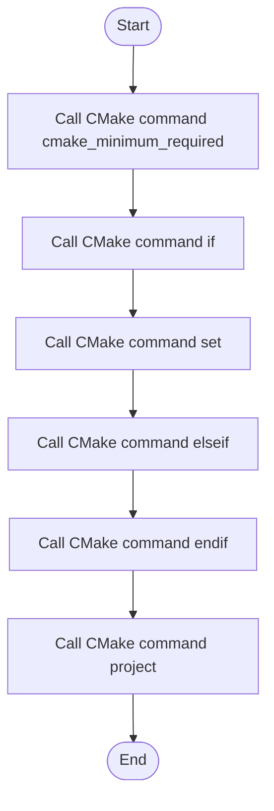

# CMakeLists.txt

- Source: CMakeLists.txt
- Kind: Text artifact
- Lines: 43
- Role: Builds the NeoTerritory executable from the microservice layer and module sources.
- Chronology: This artifact participates in the repository flow according to the surrounding module or toolchain that loads it.

## Notable Symbols
- cmake_minimum_required
- if
- set
- elseif
- endif
- project
- file
- add_executable
- target_include_directories

## Direct Dependencies
- No direct dependency list was extracted from the file text.

## Implementation Story
This file is the compile-time assembly point for the C++ system. Its implementation chooses compiler defaults, sets the language standard, gathers microservice sources and headers, and then binds them into the single NeoTerritory executable with the include paths the parser and pattern modules expect. Builds the NeoTerritory executable from the microservice layer and module sources. This artifact participates in the repository flow according to the surrounding module or toolchain that loads it. The implementation surface is easiest to recognize through symbols such as cmake_minimum_required, if, set, and elseif.

## Activity Diagram

## Documentation Note
- This markdown file is part of the generated docs/Codebase mirror.
- It was generated from the repository state on 2026-04-22 after reading the existing docs corpus and the current source tree.

