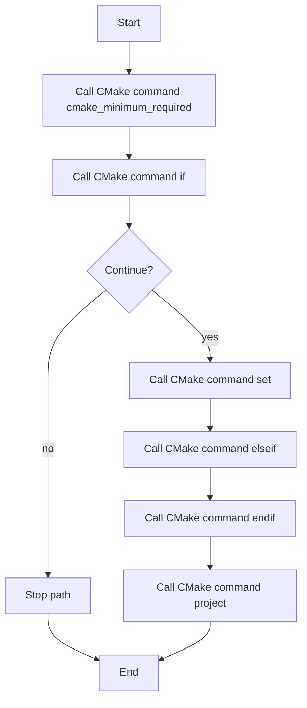

# CMakeLists.txt

- Source: CMakeLists.txt
- Kind: Text artifact
- Lines: 43

## Story
### What Happens Here

This file is the compile-time assembly point for the C++ system. Its implementation chooses compiler defaults, sets the language standard, gathers microservice sources and headers, and then binds them into the single NeoTerritory executable with the include paths the parser and pattern modules expect.

### Why It Matters In The Flow

This artifact participates in the repository flow according to the surrounding module or toolchain that loads it.

### What To Watch While Reading

Builds the NeoTerritory executable from the microservice layer and module sources. The main surface area is easiest to track through symbols such as cmake_minimum_required, if, set, and elseif.

## Program Flow
This diagram follows the action path in plain words. Decision diamonds show where the file can stop, branch, or repeat work instead of simply passing through a straight line.

## Reading Map
Read this file as: Builds the NeoTerritory executable from the microservice layer and module sources.

Where it sits in the run: This artifact participates in the repository flow according to the surrounding module or toolchain that loads it.

Names worth recognizing while reading: cmake_minimum_required, if, set, elseif, endif, and project.

## Documentation Note
- This markdown file is part of the generated docs/Codebase mirror.
- It was generated from the repository state on 2026-04-23 after reading the existing docs corpus and the current source tree.

