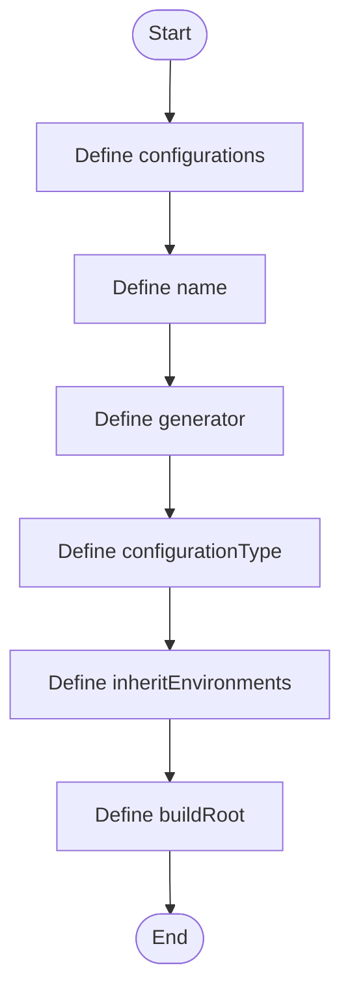

# CMakeSettings.json

- Source: CMakeSettings.json
- Kind: JSON configuration
- Lines: 15
- Role: Stores IDE-oriented CMake configuration defaults.
- Chronology: This artifact participates in the repository flow according to the surrounding module or toolchain that loads it.

## Notable Symbols
- configurations
- name
- generator
- configurationType
- inheritEnvironments
- buildRoot
- installRoot
- cmakeCommandArgs
- buildCommandArgs
- ctestCommandArgs

## Direct Dependencies
- No direct dependency list was extracted from the file text.

## Implementation Story
This file participates in the NeoTerritory implementation as a focused artifact with a narrow local responsibility. Its behavior is best understood by reading it in the context of the module that loads or compiles it. Stores IDE-oriented CMake configuration defaults. This artifact participates in the repository flow according to the surrounding module or toolchain that loads it. The implementation surface is easiest to recognize through symbols such as configurations, name, generator, and configurationType.

## Activity Diagram

## Documentation Note
- This markdown file is part of the generated docs/Codebase mirror.
- It was generated from the repository state on 2026-04-22 after reading the existing docs corpus and the current source tree.

