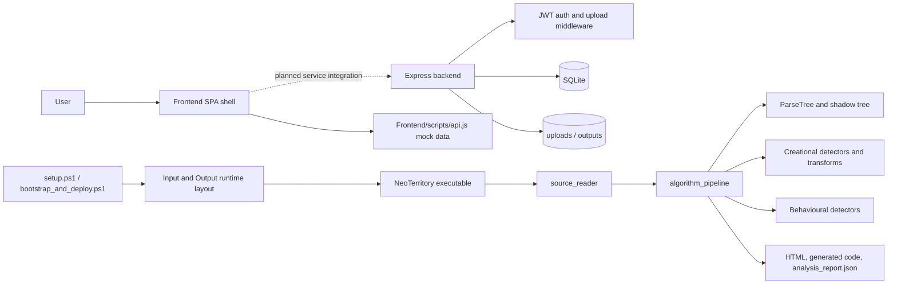
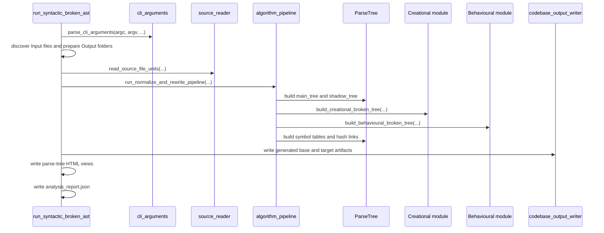
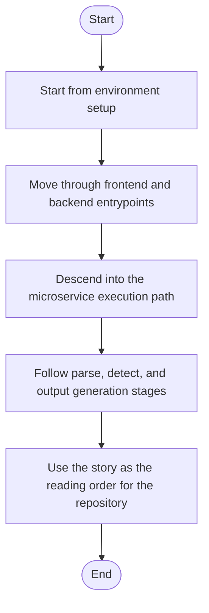

# Codebase Story

This document explains NeoTerritory as a running system instead of as a pile of folders. The repository currently has three different maturity levels at once:

- `Frontend` is a browser prototype with hash routing and mostly mock data.
- `Backend` is a secure Express service with auth, uploads, SQLite bookkeeping, and a placeholder transform path.
- `Microservice` is the most implementation-heavy part of the repo and contains the real parse, detect, hash-link, render, and report pipeline.

## Repository Story

The story starts with setup and deployment automation. On Windows, `setup.ps1` relaunches itself as Administrator and then hands off to `Infrastructure/session-orchestration/bootstrap_and_deploy.ps1`. That script installs or locates Docker, Minikube, and `kubectl`, starts the local cluster, builds the session image, applies the Kubernetes templates, and prepares the runtime `Input` and `Output` folders that the C++ executable expects.

Once the environment exists, the repository splits into two user-facing entry paths. The browser path begins in `Frontend/index.html`, where the SPA shell loads the sidebar, router, and page scripts. The service path begins in `Backend/server.js`, where Express mounts `/health`, `/auth`, and `/api/transform`, initializes SQLite, and guarantees `uploads` and `outputs` exist.

The deepest story is the C++ executable. `Microservice/main.cpp` forwards directly to `run_syntactic_broken_ast(...)` in `Microservice/Layer/Back system/syntacticBrokenAST.cpp`. That runner validates CLI arguments, discovers top-level input files, reads them into `SourceFileUnit` records, executes the pipeline, prints tree diagnostics, renders HTML views, writes generated base and target code, and serializes the final JSON report.

## Chronology

### 1. Environment bootstrap

- `setup.ps1` handles Windows elevation and forwards arguments.
- `Infrastructure/session-orchestration/bootstrap_and_deploy.ps1` resolves tools, starts Docker and Minikube, builds the image, applies templates, and calls the runtime-layout script.
- `Infrastructure/runtime-layout/setup_runtime_layout.ps1` creates the `Input`, `Output/analysis_report`, `Output/generated_code`, and `Output/html` folders.

### 2. Frontend shell

- `Frontend/index.html` defines the fixed shell: sidebar, page-content container, and mobile controls.
- `Frontend/scripts/router.js` swaps route fragments into the shell and runs page init hooks.
- `Frontend/scripts/sidebar.js` handles nav clicks, theme persistence, and responsive sidebar state.
- `Frontend/scripts/api.js` currently supplies mock records, which means the frontend is still more demo/prototype than live client.

### 3. Backend API path

- `Backend/server.js` mounts middleware and routes.
- `Backend/src/routes/*.js` map endpoints to auth, upload, and transform handlers.
- `Backend/src/controllers/authController.js` creates users, verifies passwords, and returns JWTs.
- `Backend/src/controllers/transformController.js` currently sanitizes uploads, creates placeholder output files, stores a job row, and logs the event.
- `Backend/src/db/initDb.js` creates the `users`, `jobs`, and `logs` tables.

### 4. Microservice execution path

- `Microservice/main.cpp` is only a handoff.
- `Microservice/Layer/Back system/syntacticBrokenAST.cpp` is the true process runner.
- `cli_arguments.cpp` enforces the `source_pattern target_pattern` contract.
- `source_reader.cpp` loads each discovered source file and can merge them into a monolithic source view.
- `algorithm_pipeline.cpp` coordinates the ordered stages: base parse, pattern detection, virtual subgraph reuse, symbol-table and hash-link construction, monolithic generation, target policy application, and invariant validation.

### 5. Parse-tree construction

- `ParseTree/core.cpp` builds a `Root` translation unit plus one `FileUnit` per source file.
- `ParseTree/Internal/build.cpp` tokenizes lines, registers class hits, tracks factory call sites, collects line hash traces, and emits the file-local tree structure.
- The pipeline maintains both a full `main_tree` and a relevance-filtered `shadow_tree`.
- Include dependencies and cross-file symbol dependencies are attached after the raw per-file parse.

### 6. Pattern detection and evidence

- `Modules/Source/Creational/creational_broken_tree.cpp` delegates to factory, singleton, and builder detectors.
- `Modules/Source/Behavioural/behavioural_broken_tree.cpp` delegates to function-scaffold and structure-check detectors.
- `lexical_structure_hooks.cpp` bridges the generic parser to pattern-specific keyword providers in the creational and behavioural modules.
- `parse_tree_code_generator.cpp` uses the creational transform pipeline to render source and target evidence views.

### 7. Output generation

- `codebase_output_writer.cpp` writes generated C++ and HTML output files.
- `syntacticBrokenAST.cpp` also writes parse-tree HTML, creational HTML, behavioural HTML, and the JSON report returned by `pipeline_report_to_json(...)`.
- The output contract lands under `Output/generated_code`, `Output/html`, and `Output/analysis_report`.

## Practical Reading Order

If you want to understand the repository quickly, read in this order:

1. `docs/Guides/Microservice/Algorithm_Plan.md`
2. `docs/Guides/Microservice/Algorithm_Implementation.md`
3. `docs/Guides/Microservice/AST_Pipeline_Step_Map.md`
4. `Microservice/Layer/Back system/syntacticBrokenAST.cpp`
5. `Microservice/Modules/Source/SyntacticBrokenAST/algorithm_pipeline.cpp`
6. `Microservice/Modules/Source/SyntacticBrokenAST/ParseTree/core.cpp`
7. `Microservice/Modules/Source/SyntacticBrokenAST/ParseTree/Internal/build.cpp`
8. `Microservice/Modules/Source/Creational/creational_broken_tree.cpp`
9. `Microservice/Modules/Source/Behavioural/behavioural_broken_tree.cpp`
10. `docs/Codebase/README.md` for the generated mirror

<!-- AUTO-IMPLEMENTATION-STORY-START -->

## Implementation Story
This document is itself the high-level narrative view of the implementation. It connects the infrastructure scripts, frontend prototype, backend service, and microservice pipeline into one chronological explanation so a reader can move from setup to request handling to deep C++ parsing without guessing how the pieces fit together.

## Activity Diagram

<!-- AUTO-IMPLEMENTATION-STORY-END -->

