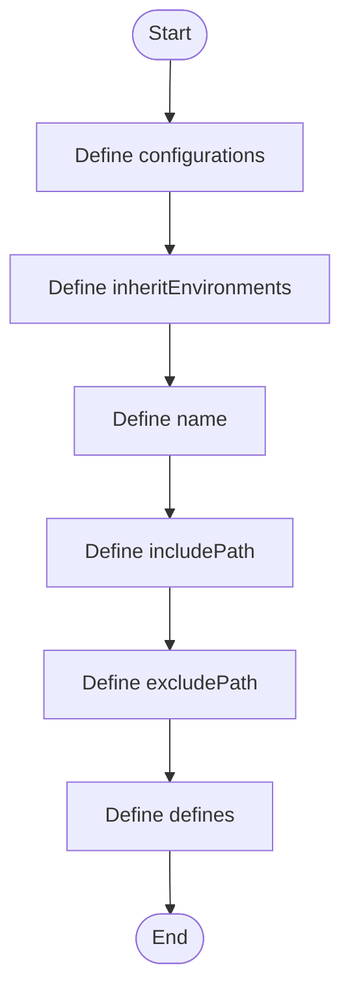

# CppProperties.json

- Source: CppProperties.json
- Kind: JSON configuration
- Lines: 25
- Role: Provides editor include-path and IntelliSense settings.
- Chronology: This artifact participates in the repository flow according to the surrounding module or toolchain that loads it.

## Notable Symbols
- configurations
- inheritEnvironments
- name
- includePath
- excludePath
- defines
- intelliSenseMode

## Direct Dependencies
- No direct dependency list was extracted from the file text.

## File Outline
### Responsibility

This file participates in the NeoTerritory implementation as a focused artifact with a narrow local responsibility. Its behavior is best understood by reading it in the context of the module that loads or compiles it.

### Position In The Flow

This artifact participates in the repository flow according to the surrounding module or toolchain that loads it.

### Main Surface Area

Provides editor include-path and IntelliSense settings. The main surface area is easiest to track through symbols such as configurations, inheritEnvironments, name, and includePath.

## File Activity

## Documentation Note
- This markdown file is part of the generated docs/Codebase mirror.
- It was generated from the repository state on 2026-04-23 after reading the existing docs corpus and the current source tree.

