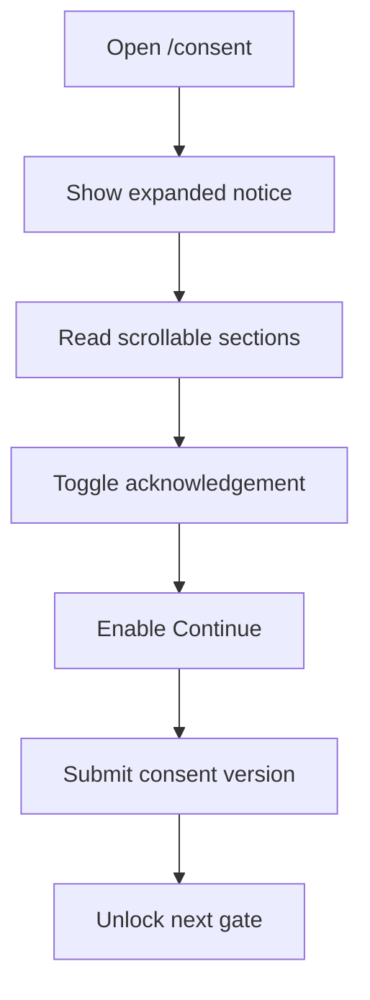

# ConsentGate.tsx

- Source: `Codebase/Frontend/src/components/survey/ConsentGate.tsx`
- Related copy: `Codebase/Frontend/src/data/surveyQuestions.ts`
- Related styles: `Codebase/Frontend/styles.css`
- Kind: Research consent gate for `/consent`

## Story
### What Happens Here

This route-sized gate blocks access to the participant flow until the user either accepts the consent notice or declines and signs out. The current implementation is intentionally small: one checkbox controls the enabled state of the Continue button, Continue records consent through `submitConsent(consentVersion)`, and Decline calls `signOut()`.

This redesign expands only the UI shell. The gate should become a premium, fully expanded "Informed Consent & Data Privacy Notice" surface while preserving the exact consent flow and validation behavior already implemented.

### Why It Matters In The Flow

This page is the first research-facing trust surface after authentication. It must feel deliberate, credible, and institutionally grounded without becoming a second implementation of auth, routing, session state, or backend validation.

### Ownership Boundary

This frontend surface may:
- restyle the existing modal into a large centered glassmorphism consent container.
- replace the simple paragraph presentation with structured consent sections and long-form content.
- add richer layout wrappers, accent callouts, badges, icons, and responsive spacing.
- keep the existing checkbox, error banner, decline button, and continue button behavior while presenting them differently.

This frontend surface must not:
- change `submitConsent(consentVersion)`.
- change `setConsentAccepted(true)`.
- change `signOut()`.
- change the route, session flow, gating order, or post-consent navigation behavior.
- change backend APIs, payload shape, auth behavior, or database handling.

## Consent Flow

Quick summary: the redesign changes how the notice is shown, not how consent is decided or recorded.

This slice stays separate from auth and routing because the request is only about presentation and trust-copy structure on the consent gate.

## Required UI Structure

### Container

- Replace the small card with a large centered consent shell that feels like a secure developer platform panel.
- Keep the outer blocking overlay and modal semantics (`role="dialog"`, `aria-modal="true"`, and title association).
- Use a glassmorphism surface over the NeoTerritory dark background: layered gradients, subtle blur, low-opacity neon borders, and soft ambient glow.

### Header

- Add a branded header row with:
  - a shield or privacy icon on the left.
  - the title `Informed Consent & Data Privacy Notice`.
  - a subtitle line showing the tester seat plus DEVCON context.
  - a `Required` status badge on the top-right.
- The subtitle should communicate that this is the DEVCON participant consent gate for a selected tester seat, not a generic privacy popup.

Suggested subtitle shape:
- `Tester Seat D8  |  NeoTerritory DEVCON Luzon  |  Please read carefully before proceeding`

### Scrollable Body

- Convert the long-form notice into a scrollable content region inside the container.
- Break the body into section cards instead of one paragraph block.
- Keep the body readable on desktop and mobile with generous line-height and card spacing.

### Footer

- Keep the current error presentation surface if submission fails.
- Keep the Continue action disabled until the checkbox is checked.
- Add a prominent Decline button that still calls the existing sign-out path.
- Preserve the sticky or always-visible action region so the user can act after reading.

## Section Layout

The body should render these sections in order:

1. `Letter to the Participants`
2. `Study Overview`
3. `Participant Responsibilities`
4. `Voluntary Participation`
5. `Data Privacy Notice`
6. `Confidentiality & Research Usage`
7. `Consent Acknowledgement`

Each section should feel like its own panel inside the main shell, with small mono-style section labels and restrained accent rules rather than loud separators.

## Content Blueprint

### Letter to the Participants

Use a direct address section that states:
- the researchers are `3rd Year BS Computer Science students specializing in Software Engineering`.
- the institution is `FEU Institute of Technology`.
- the field context is `DEVCON Luzon`.
- the study evaluates NeoTerritory as a graph-based, AST-centered documentation and design-pattern learning system.

Recommended body intent:
- invite the participant respectfully.
- explain that the system helps generate structure-aware documentation from source code using graph-based and Abstract Syntax Tree centered representations.
- explain that the study examines onboarding, code understanding, documentation support, and design-pattern learning in a real development context.

### Study Overview

State clearly that the study concerns:
- graph-based AST-centered documentation generation.
- design-pattern learning support.
- internship onboarding and source-code understanding in a developer workflow.

Suggested callout keywords:
- `graph-based`
- `AST-centered`
- `design-pattern learning`
- `DEVCON Luzon`

### Participant Responsibilities

Render this as structured bullets, not a paragraph. Include tasks such as:
- interact with NeoTerritory and explore its guided analysis workflow.
- review generated documentation and design-pattern learning outputs.
- perform short code-understanding or onboarding-oriented tasks.
- answer the evaluation questionnaire about clarity, usefulness, and usability.

### Voluntary Participation

State that:
- participation is voluntary.
- participants may decline participation.
- participants may refuse to answer any question.
- participants may withdraw at any time without penalty.

This section should visually emphasize the word `voluntary` using the NeoTerritory green accent.

### Data Privacy Notice

Explicitly mention:
- `Data Privacy Act of 2012`.
- `Republic Act No. 10173`.
- responses are collected only for academic research purposes.
- data will be treated with strict confidentiality.

This section should feel more formal and policy-like than the others.

### Confidentiality & Research Usage

State that:
- responses will be analyzed only in summarized or aggregated form.
- no personally identifiable data will be publicly disclosed.
- results will be used only for academic research purposes.
- no personally identifying information will appear in the final paper, presentation, or related outputs.

### Consent Acknowledgement

Place a large acknowledgement block near the bottom with the existing checkbox control.

The acknowledgement text should communicate:
- the participant has read and understood the Letter to the Participants and the Data Privacy Notice.
- the participant voluntarily consents to the collection, use, and processing of responses for the stated academic purpose.

The checkbox remains the single UI gate for enabling Continue.

## Visual Direction

### Brand And Palette

Keep the NeoTerritory dark futuristic identity and bias the consent gate toward premium institutional trust rather than generic SaaS modal styling.

Use the existing palette direction:
- background base: `#1A1A1A`
- purple: `#7D00FF`
- green: `#78B815`
- yellow: `#F3C110`
- orange: `#E45E1B`

Accent usage guidance:
- purple for privacy, required status, and formal section framing.
- cyan or blue-cyan from the existing product styling for borders and glow.
- green for voluntary/consent-positive language.
- yellow for academic/research emphasis.
- orange only for small highlight contrast, not dominant blocks.

### Typography

- Keep the existing NeoTerritory typographic tone with `DM Sans`, `Inter`, or `Montserrat`.
- Use bold display weight for the main title.
- Use mono-style micro-labels for section headers, seat metadata, and status badge language.

### Motion

- Preserve subtle hover and focus transitions on buttons and acknowledgement blocks.
- Add only restrained motion: soft border brightening, badge glow, checkbox-card highlight, and button elevation.
- Do not add motion that obscures readability or feels ornamental.

## Responsive Layout Guidance

- Desktop: large centered panel with a comfortable max width and a tall scrollable content body.
- Tablet: reduce padding and allow the content body to occupy more height while keeping the footer readable.
- Mobile: stack header content vertically, keep the badge visible, preserve sticky or pinned actions, and ensure the checkbox block remains easy to tap.
- Do not let the footer actions overlap the scroll area or hide the error banner.

## Implementation Notes

### Component Layer

- Keep `agree`, `busy`, `error`, `onAccept`, and `onDecline` logic intact.
- Keep `onAccept` blocked when `!agree || busy`.
- Keep the current disabled-state behavior for Continue.
- Keep the same error message behavior and render surface, even if the visual styling changes.
- Keep the same checkbox input as the source of truth; do not replace it with scroll-depth gating, timers, or alternate validation.

### Copy Layer

- The current `consentNotice` and `consentAcknowledgement` strings are too small for the requested layout.
- The redesign can introduce structured presentational content in the frontend layer, either by:
  - expanding the consent copy model in `surveyQuestions.ts`, or
  - defining a local section array inside `ConsentGate.tsx`.
- Do not change `consentVersion` as part of the visual redesign.

### Style Layer

- The current consent styles live in the generic modal block in `Codebase/Frontend/styles.css`.
- Add consent-specific selectors rather than overloading `.modal-card` globally.
- Preserve existing behavior for pretest, signout, and other modal surfaces by scoping new styling under `.consent-gate` and `.consent-card`.

## Migration Order

1. Keep the existing accept/decline logic untouched in `ConsentGate.tsx`.
2. Replace the current single-paragraph body with section-based consent content and header metadata.
3. Wrap the existing checkbox in a large acknowledgement panel near the bottom.
4. Restyle the footer actions without changing their handlers or disabled logic.
5. Add consent-specific CSS scoped to the consent gate only.
6. Verify that pretest and other modal surfaces do not inherit the new consent layout unintentionally.

## Implementation Note For Claude

Apply the redesign only in:
- `Codebase/Frontend/src/components/survey/ConsentGate.tsx`
- `Codebase/Frontend/src/data/surveyQuestions.ts` only if needed for structured display copy
- `Codebase/Frontend/styles.css`

Treat these as presentation-only changes. Do not alter router flow, store behavior, API calls, auth hooks, consent submission behavior, or any backend implementation.

## Acceptance Checks

- `/consent` renders a large centered glassmorphism consent interface instead of the small plain card.
- The header shows a privacy/shield treatment, the full title, tester-seat DEVCON subtitle, and a `Required` badge.
- The body is scrollable and split into the requested consent sections.
- The content explicitly mentions FEU Institute of Technology, 3rd Year BS Computer Science students specializing in Software Engineering, DEVCON Luzon, graph-based AST-centered documentation generation, and design-pattern learning.
- The content explicitly states voluntary participation, withdrawal rights, academic-research-only usage, and `Data Privacy Act of 2012 (Republic Act No. 10173)`.
- The acknowledgement block uses the existing checkbox and Continue remains disabled until it is checked.
- Decline still signs the user out through the existing handler.
- Continue still records consent through the existing `submitConsent(consentVersion)` path and unlocks the next gate exactly as before.
- No backend, routing, session, API, validation, or database behavior changes are introduced.
