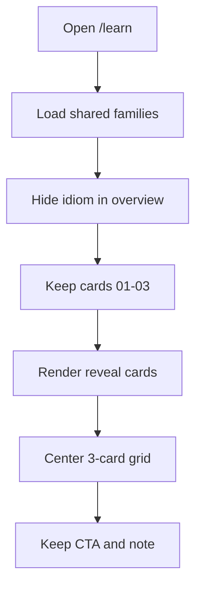

# LearningPage.tsx

- Source: `Codebase/Frontend/src/components/marketing/LearningPage.tsx`
- Related styles: `Codebase/Frontend/src/styles/marketing.css`
- Kind: Marketing `/learn` overview route

## Story
### What Happens Here

This route renders the public Learn overview on the marketing site. It keeps the referral CTA, the title stack, the family-card overview grid, and the closing student-path note on one scrollable page.

For this cleanup, the route must stop showing the `Idiom` overview card while preserving the rest of the Learn surface exactly as it behaves now.

### Why It Matters In The Flow

This is a presentation-only surface. It must not change lesson ownership, family lookup, router behavior, session gating, module loading, or any analyzer-facing content contract. The only intended effect is that the public overview now presents three pattern families instead of four.

### Ownership Boundary

This route may:
- choose which family cards appear on the public `/learn` overview.
- keep the existing `ScrollReveal`, `SplitText`, and CTA interaction wrappers.
- apply overview-specific layout classes that keep the remaining cards centered and balanced.

This route must not:
- mutate `FAMILIES` in `src/data/learningContent.ts`.
- remove the `idiom` family from shared lesson data.
- change `familyById`, `findLesson`, lesson ordering, or sample loading.
- change `navigate('/choose')`, auth flow, or any backend-facing behavior.

## UI Cleanup Flow

Quick summary: the page still reads the shared family catalog, but the marketing overview filters out `idiom` at render time and then applies a three-card layout tuned only for this page.

This slice is separate from deeper lesson routing because the request is strictly visual cleanup on the marketing overview, not a course-content rewrite.

## Implementation Notes

### Component Layer

- Derive an overview-only list inside `LearningPage.tsx`, for example by filtering `FAMILIES` down to entries whose `id` is not `idiom`.
- Map the filtered list when rendering the card grid so the visible card numbers stay sequential as `01`, `02`, `03`.
- Leave the `ScrollReveal` wrapper on the section and on each card so reveal timing and hover behavior stay unchanged.
- Do not edit the referral CTA block, the hero copy, or the closing note block.

### Data Boundary

- `Codebase/Frontend/src/data/learningContent.ts` must stay unchanged for this cleanup.
- The `idiom` family remains part of the shared content model so any other current or future surface that depends on `FAMILIES`, `familyById`, or `findLesson` keeps working.
- If a future product decision removes `Idiom` platform-wide, that should be handled as a separate data-contract change, not folded into this visual cleanup.

### Layout And Styling

- Scope the layout adjustment to the Learn overview selectors so other `nt-family-grid` usages do not regress.
- Prefer selectors rooted at `.nt-learn--overview` when changing grid columns, width caps, or centering behavior.
- Keep the existing NeoTerritory look: dark gradient surfaces, top-edge glow line, Montserrat heading treatment, cyan/purple accent gradient, hover border glow, and current shadows.
- Preserve the existing card padding, rounded corners, and hover transitions unless a spacing tweak is required to balance the three-card row.

### Responsive Grid Guidance

- Mobile: keep one card per row.
- Mid-width tablet: allow a two-column grid, but center the orphan third card on its own row instead of leaving it left-biased.
- Desktop: switch the overview grid to a true three-column layout so the remaining cards sit on one centered row.
- Keep section `max-width` and horizontal padding balanced so the grid reads as intentionally centered after the fourth card is removed.

## Migration Order

1. Add an overview-only filtered family list in `LearningPage.tsx`.
2. Keep the card render loop, numbering, and animation wrappers driven by that filtered list.
3. Add overview-scoped CSS in `marketing.css` for the three-card desktop layout and centered tablet fallback.
4. Verify that other family-grid surfaces still use their existing layout rules.

## Implementation Note For Claude

Apply the UI change in `Codebase/Frontend/src/components/marketing/LearningPage.tsx` and `Codebase/Frontend/src/styles/marketing.css` only. Treat `Codebase/Frontend/src/data/learningContent.ts` as read-only for this task so the cleanup stays visual and does not change shared lesson logic.

## Acceptance Checks

- The public `/learn` overview shows `Creational`, `Behavioural`, and `Structural`, and does not show `Idiom`.
- The three visible cards keep their current reveal animation, hover glow, border treatment, typography, and card chrome.
- The visible card numbers render as `01`, `02`, `03`.
- Desktop layout presents the three cards on one centered row.
- Tablet layout does not leave the last visible card awkwardly left-aligned.
- Mobile layout still stacks cleanly with the same dark-theme spacing rhythm.
- No edits are made to lesson content data, family lookup helpers, router behavior, session-seat flow, analyzer integration, or backend contracts.
