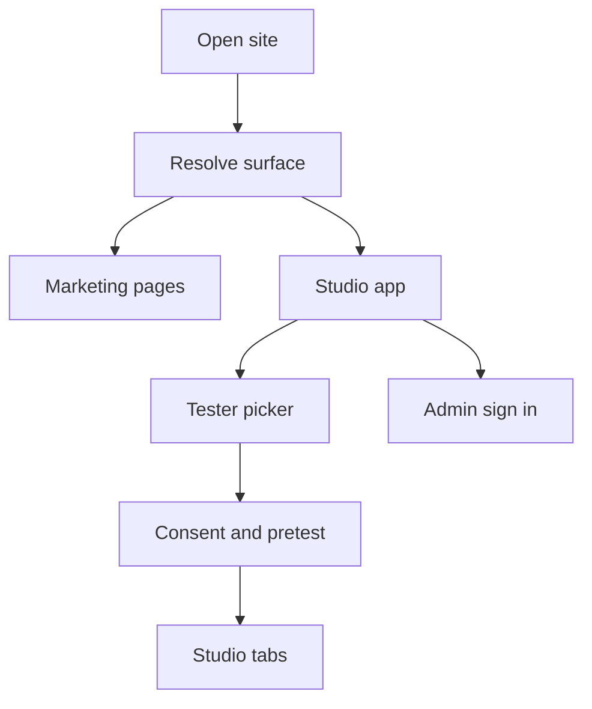
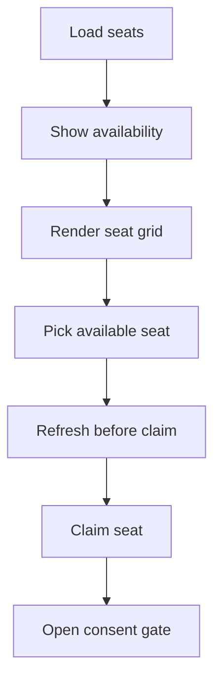
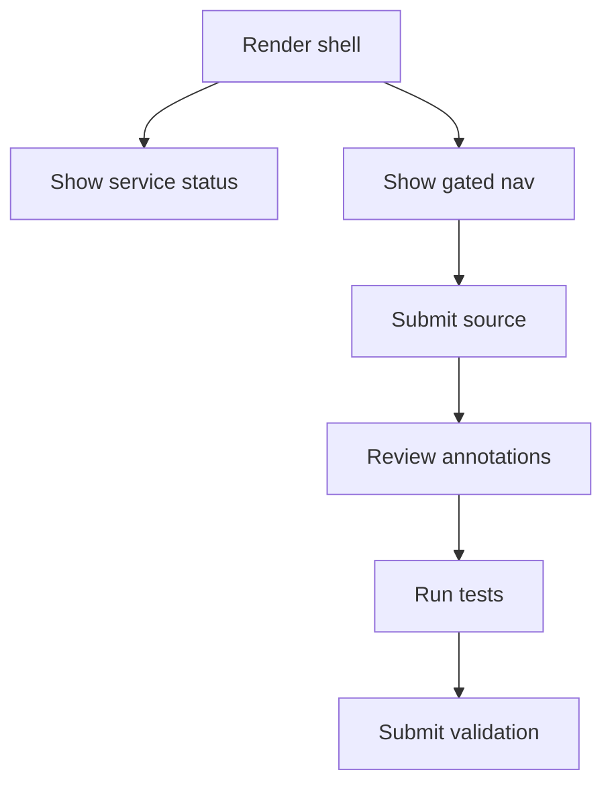
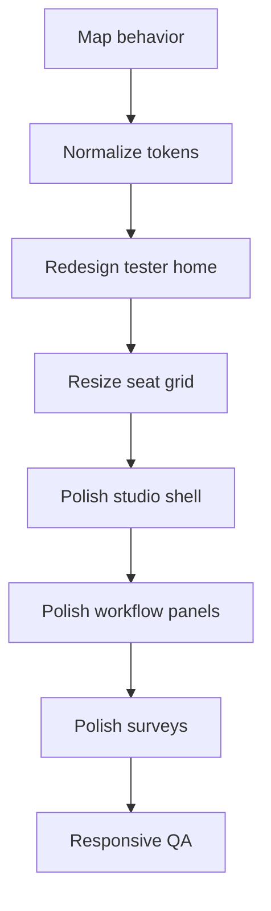

# Frontend

- Folder: `docs/Codebase/Frontend`
- Source boundary: `Codebase/Frontend`
- Primary visual reference: Figma Make `CodiNeo-V1`, preview route `/tester-home`
- Current implementation family: Vite, React, TypeScript, CSS

## Purpose

The frontend is the human-facing surface for NeoTerritory and CodiNeo. It presents public learning pages, tester onboarding, seat selection, research consent gates, the analysis studio, survey collection, and the admin entry surface.

The frontend must stay presentation-only. It may improve layout, styling, responsive behavior, component composition, copy hierarchy, focus states, and interaction polish. It must not change backend logic, authentication semantics, API contracts, validation rules, data persistence, analysis behavior, routing meaning, or workflow order.

## Ownership Boundary

The frontend owns:
- Marketing and learning presentation for `/`, `/learn`, and `/about`
- Tester entry presentation for `/login` and `/seat-selection`
- Admin sign-in presentation for `/app`
- Consent, pretest, run-review, and sign-out survey presentation
- Studio shell, navigation, status display, tabs, forms, panels, modals, responsive layout, and visual state styling
- Accessibility affordances such as focus rings, readable contrast, target sizing, ARIA labels, and reduced-motion behavior

The frontend does not own:
- Seat allocation rules
- Tester account availability logic
- Authentication flow
- JWT storage and revocation behavior
- Backend health, microservice health, Docker state, or AI provider state
- Analysis submission contract
- Pattern detection, annotation, ranking, GDB execution, survey storage, or manual review submission
- Admin authorization or admin data aggregation

## Read Order

Read these source files in this order before implementing the visual pass:
- `Codebase/Frontend/src/App.tsx`
- `Codebase/Frontend/src/lib/router.ts`
- `Codebase/Frontend/src/components/studio/StudioApp.tsx`
- `Codebase/Frontend/src/components/auth/LoginOverlay.tsx`
- `Codebase/Frontend/src/components/survey/ConsentGate.tsx`
- `Codebase/Frontend/src/components/survey/PretestForm.tsx`
- `Codebase/Frontend/src/components/layout/MainLayout.tsx`
- `Codebase/Frontend/src/components/tabs/SubmitTab.tsx`
- `Codebase/Frontend/src/components/tabs/AnnotatedTab.tsx`
- `Codebase/Frontend/src/components/tabs/GdbRunnerTab.tsx`
- `Codebase/Frontend/src/components/tabs/AmbiguousTab.tsx`
- `Codebase/Frontend/styles.css`
- `Codebase/Frontend/src/styles/marketing.css`

Use the Figma Make `/tester-home` screen as the primary visual, UX, layout, and interaction reference when editing those files.

## Surface Flow

The existing route behavior is part of the application contract and must be preserved.

Keep these route meanings intact:
- `/`, `/learn`, `/about`: public marketing and learning surfaces
- `/login`: tester home and onboarding entry
- `/seat-selection`: tester seat picker
- `/app`: admin sign-in entry
- `/consent`: participant consent gate after a seat claim
- `/pretest`: participant pretest gate after consent
- `/studio`: authenticated tester workspace
- `/admin.html`: dedicated admin dashboard

## Visual Direction

The redesign should feel like a real developer onboarding and collaboration product. Favor quiet professional density over decorative spectacle.

Use:
- Solid readable typography
- Neutral surfaces with restrained blue, violet, green, amber, and red semantic accents
- Consistent spacing based on an 8 px rhythm
- Cards with practical radii, preferably 6 px to 8 px
- Thin borders and low shadows
- Clear active, disabled, loading, success, warning, and error states
- Smooth but minimal transitions
- Responsive grids that keep actions reachable on touch screens

Avoid:
- Gradient text
- Glow-heavy typography
- Neon effects
- Large decorative shadows
- Random card layouts
- Excessive blur, tilt, and magnetic motion
- Oversized border radius on work surfaces
- Pulsing or glowing tab effects
- Copy that explains the UI instead of supporting the workflow

Gradients are allowed only on primary buttons, brand marks, and subtle background overlays. Typography must use solid colors.

## Design Token Direction

Keep token definitions centralized in `Codebase/Frontend/styles.css` and `Codebase/Frontend/src/styles/marketing.css`.

Recommended token intent:
- Background: near-black or near-white app canvas, not saturated slate
- Surface: two levels only, page surface and raised panel
- Border: one default and one stronger focus/hover border
- Accent: blue-violet for primary actions and active navigation
- Success: green for available seats, passed tests, saved/submitted states
- Warning: amber for ambiguous tags and blocked workflow steps
- Error: red for rejected claims, failed tests, failed API calls
- Typography: Inter for UI, JetBrains Mono for code, labels, file names, and identifiers

Do not create one-off colors in component files. If a new color is necessary, add it as a token with a semantic name.

## Tester Home

`LoginOverlay.tsx` owns the logged-out tester experience. It currently switches between:
- `home`: tester session overview
- `seats`: seat selection grid
- `admin`: admin sign-in form when the path is `/app`

The Figma Make `/tester-home` reference should guide this screen first. Preserve `getPathMode`, `getInitialView`, `fetchTesterAccounts`, `claimSeat`, `signIn`, and the route replacement behavior.

Tester home should become a focused onboarding dashboard:
- Brand and session context at the top
- Seat availability summary visible before the user enters the grid
- A concise workflow sequence: seat selection, consent, testing dashboard, post-test survey
- Primary action leading to seat selection
- Admin sign-in as a quiet secondary link
- No marketing hero treatment inside the tester workflow

Keep the screen usable at small heights. If content is taller than the viewport, the card body should scroll internally while primary actions remain reachable.

## Seat Selection

The seat grid is the most important usability improvement. It must be spacious, clear, and easy to click or tap.

Implementation requirements:
- Increase desktop seat tiles to a comfortable card size, with a target minimum around 132 px wide and 104 px tall.
- Keep mobile tiles touch-safe, with a target minimum around 88 px wide and 72 px tall.
- Use `grid-template-columns: repeat(auto-fit, minmax(...))` so the grid scales naturally.
- Use at least 14 px to 18 px spacing on desktop and at least 10 px spacing on mobile.
- Preserve the existing `accounts.map` data source and `handleClaim` behavior.
- Preserve the pre-flight `fetchTesterAccounts` refresh before calling `claimSeat`.
- Add visible state labels for available, in use, and claiming.
- Do not rely on opacity alone for occupied seats; use text, border style, and muted surface together.
- Keep disabled occupied seats readable and visibly unavailable.
- Add clear `aria-label` values that include the seat name and state.
- Use focus-visible styling that matches hover strength.
- Avoid overcrowding. If the room has many seats, let the grid scroll inside the seat panel.

State presentation:
- Available: strong text, subtle green or accent indicator, hover border, pointer cursor
- Claiming: disabled button, spinner or small progress label, unchanged layout size
- Occupied: muted surface, dashed border, explicit `In use` label, no hover lift
- Error: inline error banner below the grid, not a layout-shifting toast

## Studio Shell

`MainLayout.tsx` owns the authenticated studio shell. It must keep its tab state and gating logic intact.

The current topbar and horizontal tab bar can be restyled into a more app-like developer dashboard. The preferred direction is:
- Desktop: left sidebar navigation with compact icon/text items for Submit, Annotated Source, GDB Runner, and Review before submission
- Tablet: collapsible rail or top segmented navigation
- Mobile: compact top navigation or scrollable segmented control

Do not alter `TABS`, `tabUnlocked`, `tabLockReason`, `setActiveTab`, or the sequential workflow rules. The visual navigation can change, but locked tabs must remain disabled and explain their prerequisite.

Status presentation should become compact and scannable:
- Backend, microservice, Docker, and AI states should read as small status chips.
- Username, theme toggle, and sign-out should sit in a predictable user-control group.
- Error and busy states should remain visible without dominating the shell.

## Submit Workflow

`SubmitTab.tsx`, `AnalysisForm.tsx`, and `RunList.tsx` should read like a developer workbench.

Preserve:
- Multi-file slot state
- Accepted extensions
- File cap logic
- Sample loading
- Standard input field
- Analysis dispatch body shape
- Saved run loading behavior

Improve presentation:
- Two-column desktop layout: source submission as the primary area, saved runs as a secondary panel
- Single-column mobile layout with saved runs below the form
- File tabs that do not overflow the viewport
- Larger code editor area with clear filename and upload controls
- Action row with clear primary, secondary, and destructive hierarchy
- Empty and loading states that preserve panel height

## Annotated Source Workflow

`AnnotatedTab.tsx` is the main technical analysis surface. It must remain dense and readable.

Preserve:
- `deriveAnnotatedModel`
- Active file switching
- Source line flash behavior
- Pattern/class resolution behavior
- CTA phase order: tag, GDB, submit, review
- Class navigator behavior
- Pattern cards and class binding data sources

Improve presentation:
- Keep source code as the dominant column.
- Keep pattern evidence and class bindings in a right-side inspector on desktop.
- On mobile, stack inspector content below source and keep the class navigation buttons reachable.
- Use clear badges for tagged, missing, and untagged classes.
- Keep popovers compact and readable with strong focus states.
- Avoid floating UI that covers source lines without a clear dismiss path.

## GDB Runner Workflow

`GdbRunnerTab.tsx` should present test execution like a CI result inspector.

Preserve:
- Local ambiguity gate
- Rate limit cooldown handling
- Run identity cache
- `runPatternTests` payload shape
- Pass/fail aggregation
- Program stdin wiring

Improve presentation:
- Left tree as a compact result navigator on desktop
- Result pane as the primary detail area
- Clear phase rows for compile/run and unit-test verdict
- Strong but restrained pass/fail/warning states
- Auto-expanded error output only when useful
- Mobile layout that stacks tree above details without horizontal overflow

## Review And Survey Workflow

`AmbiguousTab.tsx`, `ConsentGate.tsx`, `PretestForm.tsx`, and `SignoutSurvey.tsx` must preserve all required gates and POST behavior.

Improve presentation:
- Treat consent and surveys as formal workflow steps, not generic modals.
- Use consistent modal widths, sticky action bars, and readable scroll areas.
- Keep every required item visually trackable.
- Make Likert and star controls touch-friendly.
- Keep disabled submit states clear and explain missing requirements in existing error channels.

Do not make consent, pretest, per-run ratings, sign-out ratings, or validation submission optional unless the existing code already allows it for that user type.

## Landing And Learning Pages

The marketing surface can be polished, but it must not distract from the tester workflow.

Update direction:
- Hero headline should identify CodiNeo or NeoTerritory directly.
- Supporting copy can explain the product value; the headline should not rely on abstract slogans.
- Replace overly large editorial type with a scale that fits developer SaaS.
- Use a real product-preview composition or workflow preview rather than decorative-only effects.
- Keep animations subtle and disabled under reduced-motion.
- Make `Open studio` and `Learn` actions clear without changing route behavior.

## Component Quality Rules

When implementation is authorized, prefer reusable UI primitives where the current code repeats patterns:
- App shell sections
- Status chips
- Navigation items
- Button variants
- Modal header/body/action layout
- Survey question rows
- Seat tiles
- Empty states
- Error banners

Do not introduce a new routing library, state library, API client, auth wrapper, backend schema, or build dependency solely for the redesign. If icons are added, prefer an existing icon dependency if one already exists in the frontend package; otherwise keep inline SVGs small and local.

## Migration Order

Implementation order:
1. Map the behavior boundaries and mark the functions that must not change.
2. Normalize CSS tokens, radii, shadows, focus rings, and reduced-motion behavior.
3. Redesign `LoginOverlay.tsx` home state against the Figma Make `/tester-home` reference.
4. Redesign the seat grid and state indicators.
5. Convert or restyle the studio navigation into the Figma-aligned app shell without changing tab behavior.
6. Polish Submit, Annotated Source, GDB Runner, and Review panels.
7. Polish consent, pretest, and sign-out survey modals.
8. Bring marketing pages into the same CodiNeo product language.
9. Run visual and functional QA across logged-out, tester, and admin paths.

## Acceptance Checks

Functional preservation:
- `/login` still opens tester home.
- `/seat-selection` still opens the seat picker.
- `/app` still opens admin sign-in when logged out.
- Claimed seats cannot be selected.
- Seat claim still calls the same backend flow.
- Consent appears after a tester seat is claimed.
- Pretest appears after consent when questions exist.
- Studio tabs stay gated in the same order.
- Analysis submission payload shape is unchanged.
- GDB runner payload shape is unchanged.
- Review and survey submission endpoints are unchanged.
- Admin users still redirect to `/admin.html`.

Visual and accessibility:
- No horizontal overflow at 320 px, 390 px, 768 px, 1024 px, and 1440 px.
- Seat tiles meet touch-friendly sizing on mobile.
- Available, occupied, selected, claiming, locked, success, warning, and error states are visible without color alone.
- Focus-visible states are obvious on all buttons, tabs, links, form controls, seat tiles, popovers, and modal actions.
- Motion is disabled or minimized under `prefers-reduced-motion`.
- Text never overlaps controls or adjacent cards.
- Buttons and cards keep stable dimensions during loading states.
- Contrast is readable in both dark and light themes.
- The UI does not use gradient text, neon effects, excessive glow, or oversized shadows.

Figma alignment:
- Tester home follows the Figma Make layout hierarchy and interaction flow.
- Navigation positioning, card spacing, typography scale, and dashboard organization are checked against the Figma Make reference before final implementation.
- Any intentional visual deviation from the Figma reference is documented in the implementation notes for accessibility, responsiveness, or existing workflow preservation.
