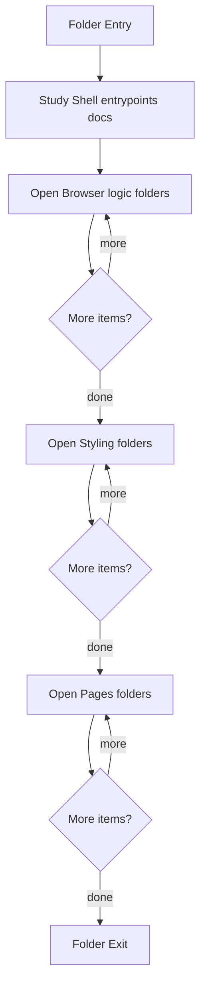

# Frontend

- Folder: docs/Codebase/Frontend
- Descendant source docs: 15
- Generated on: 2026-04-23

## Logic Summary
Frontend prototype shell. This area groups the browser entrypoint with route fragments, scripts, and styles.

## Subsystem Story
This folder mixes concrete local documents with deeper child subsystems. Read the local docs to understand the visible behavior first, then descend into the child folders for the lower-level detail that supports it.

## Folder Flow

## Child Folders By Logic
### Browser Logic
These child folders continue the subsystem by covering Browser logic that powers routing, UI state changes, mock data usage, and page interactions.
- scripts/ : Browser logic that powers routing, UI state changes, mock data usage, and page interactions.

### Styling
These child folders continue the subsystem by covering Visual system and component styling for the prototype frontend.
- styles/ : Visual system and component styling for the prototype frontend.

### Pages
These child folders continue the subsystem by covering Route-sized HTML fragments loaded by the client router.
- pages/ : Route-sized HTML fragments loaded by the client router.

## Documents By Logic
### Shell Entrypoints
These documents explain the local implementation by covering Defines the shell document for the hash-routed frontend application.
- index.html.md : Defines the shell document for the hash-routed frontend application.

## Reading Hint
- Read the local file docs first for concrete behavior, then descend into the child folders for narrower subsystem details.

