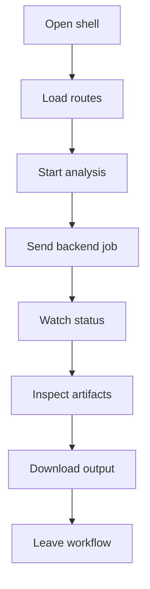

# Frontend

- Folder: docs/Codebase/Frontend
- Descendant source docs: 15
- Generated on: 2026-04-23
- Alignment update: 2026-04-25

## Logic Summary
Operator-facing browser shell for the NeoTerritory analysis workflow. This area groups the entrypoint, route fragments, scripts, and styles that let a user submit source input, follow backend job progress, inspect C++ microservice artifacts, and download the generated output package.

## Ownership Boundary
The frontend owns navigation, upload/start controls, job-progress presentation, artifact previews, and download affordances. It must not own AST parsing, pattern detection, transformation rules, diff generation, documentation tagging, or output-file layout. Those concerns belong to the backend bridge and the C++ microservice docs under `docs/Codebase/Microservice`.

## Microservice Alignment
The frontend is the human-facing surface for a backend-orchestrated microservice run:
- It sends source input and run options to the backend transform route.
- It displays job state returned by the backend instead of inventing local analysis state.
- It renders artifacts produced by the microservice, including reports, parse-tree views, diff views, validation checks, and downloadable output.
- It treats local placeholder data as temporary scaffolding only until the backend exposes the real artifact contract.

## Subsystem Story
This folder mixes concrete shell documents with deeper child subsystems. Read `index.html.md` first for the persistent browser frame, then read `scripts/api.js.md` for the backend contract, then read the page docs in workflow order: dashboard, new analysis, results, diff viewer, fix suggestions, and download.

## Folder Flow

## Child Folders By Logic
### Browser Logic
These child folders continue the subsystem by covering browser coordination, backend API calls, job state, artifact rendering, and page interactions.
- scripts/ : Browser logic that powers routing, backend communication, job progress, artifact rendering, and UI state changes.

### Styling
These child folders continue the subsystem by covering visual system and component styling for the analysis workflow frontend.
- styles/ : Visual system and component styling for the analysis workflow frontend.

### Pages
These child folders continue the subsystem by covering route-sized HTML fragments loaded by the client router.
- pages/ : Route-sized workflow screens for dashboard, analysis submission, result inspection, suggested fixes, and output download.

## Documents By Logic
### Shell Entrypoints
These documents explain the local implementation by covering Defines the shell document for the hash-routed frontend application.
- index.html.md : Defines the persistent browser shell for the microservice analysis workflow.

## Reading Hint
- Read the shell first, then the API boundary, then the pages in user workflow order. Any analysis result shown in this folder should trace back to backend or microservice output, not frontend-only inference.

