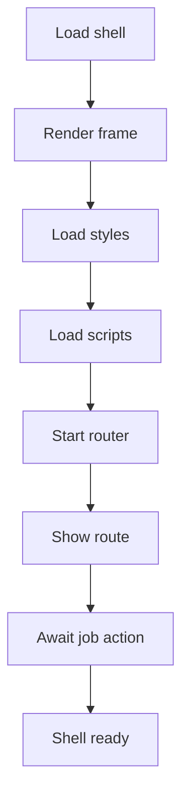

# index.html

- Source: Frontend/index.html
- Kind: HTML view

## Story
### What Happens Here

This file is the persistent browser shell for the microservice analysis workflow. Its implementation lays out the application frame, loads shared styles and scripts, and starts the router and sidebar logic that expose the dashboard, analysis submission, result review, fix suggestions, and download pages.

### Why It Matters In The Flow

Browser entrypoint: the user loads this shell before any route fragment, backend job state, or microservice artifact is rendered.

### What To Watch While Reading

Defines the shell document for the hash-routed frontend application. The shell should stay focused on persistent layout and bootstrapping. Analysis behavior belongs to page scripts, backend calls belong to `scripts/api.js`, and AST or transform logic belongs to the microservice.

## Program Flow
This diagram follows the action path in plain words. Decision diamonds show where the file can stop, branch, or repeat work instead of simply passing through a straight line.

## Reading Map
Read this file as: Defines the persistent browser shell for the microservice analysis workflow.

Where it sits in the run: Browser entrypoint before route fragments, backend job state, or microservice artifacts are rendered.

Names worth recognizing while reading: #app, #sidebar, #sidebar-overlay, #main-content, #page-content, and #menu-fab.

It leans on nearby contracts or tools such as styles/main.css, styles/components.css, scripts/diff-viewer.js, scripts/fix-suggestions.js, and scripts/analysis.js.

## Documentation Note
- This markdown file is part of the generated docs/Codebase mirror.
- It was generated from the repository state on 2026-04-23 after reading the existing docs corpus and the current source tree.

