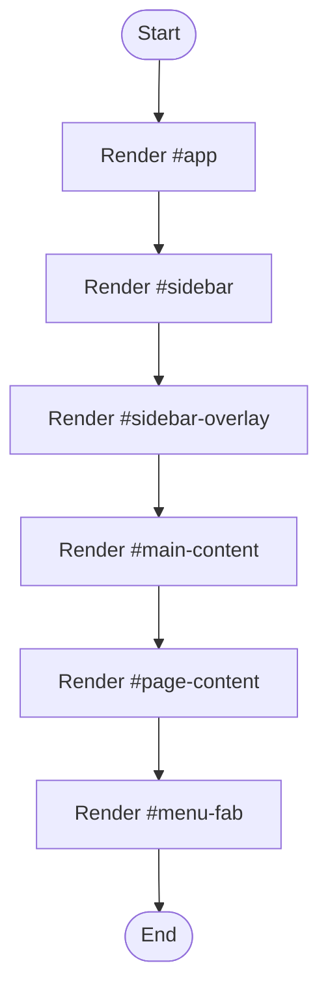

# index.html

- Source: Frontend/index.html
- Kind: HTML view
- Lines: 145
- Role: Defines the shell document for the hash-routed frontend application.
- Chronology: Browser entrypoint: the user loads this shell before any route fragment or mock data is rendered.

## Notable Symbols
- #app
- #sidebar
- #sidebar-overlay
- #main-content
- #page-content
- #menu-fab

## Direct Dependencies
- styles/main.css
- styles/components.css
- scripts/diff-viewer.js
- scripts/fix-suggestions.js
- scripts/analysis.js

## File Outline
### Responsibility

This file is the shell document for the frontend prototype. Its implementation lays out the persistent frame of the application, loads the shared styles and scripts, and then starts the router and sidebar logic that populate the page.

### Position In The Flow

Browser entrypoint: the user loads this shell before any route fragment or mock data is rendered.

### Main Surface Area

Defines the shell document for the hash-routed frontend application. The main surface area is easiest to track through symbols such as #app, #sidebar, #sidebar-overlay, and #main-content. It collaborates directly with styles/main.css, styles/components.css, scripts/diff-viewer.js, and scripts/fix-suggestions.js.

## File Activity

## Documentation Note
- This markdown file is part of the generated docs/Codebase mirror.
- It was generated from the repository state on 2026-04-23 after reading the existing docs corpus and the current source tree.

