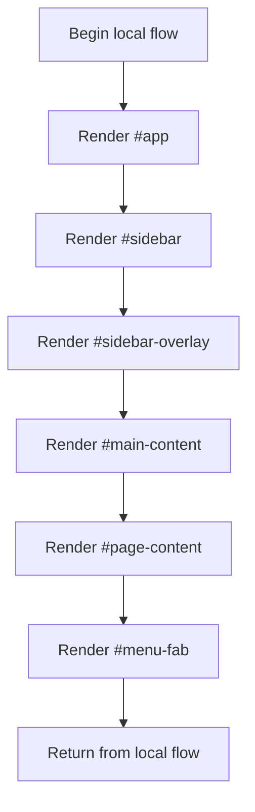

# index.html

- Source: Frontend/index.html
- Kind: HTML view

## Story
### What Happens Here

This file is the shell document for the frontend prototype. Its implementation lays out the persistent frame of the application, loads the shared styles and scripts, and then starts the router and sidebar logic that populate the page.

### Why It Matters In The Flow

Browser entrypoint: the user loads this shell before any route fragment or mock data is rendered.

### What To Watch While Reading

Defines the shell document for the hash-routed frontend application. The main surface area is easiest to track through symbols such as #app, #sidebar, #sidebar-overlay, and #main-content. It collaborates directly with styles/main.css, styles/components.css, scripts/diff-viewer.js, and scripts/fix-suggestions.js.

## Program Flow
This diagram follows the action path in plain words. Decision diamonds show where the file can stop, branch, or repeat work instead of simply passing through a straight line.

## Reading Map
Read this file as: Defines the shell document for the hash-routed frontend application.

Where it sits in the run: Browser entrypoint: the user loads this shell before any route fragment or mock data is rendered.

Names worth recognizing while reading: #app, #sidebar, #sidebar-overlay, #main-content, #page-content, and #menu-fab.

It leans on nearby contracts or tools such as styles/main.css, styles/components.css, scripts/diff-viewer.js, scripts/fix-suggestions.js, and scripts/analysis.js.

## Documentation Note
- This markdown file is part of the generated docs/Codebase mirror.
- It was generated from the repository state on 2026-04-23 after reading the existing docs corpus and the current source tree.

