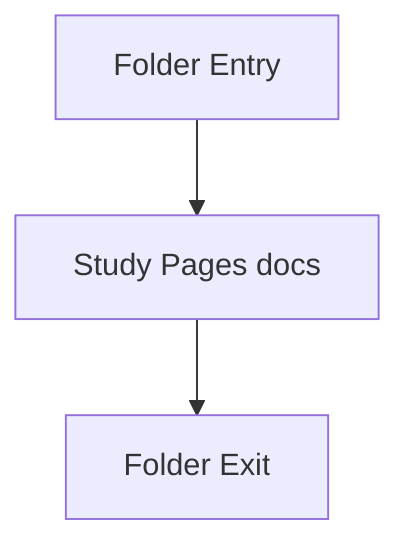

# pages

- Folder: docs/Codebase/Frontend/pages
- Descendant source docs: 6
- Generated on: 2026-04-23

## Logic Summary
Route-sized HTML fragments loaded by the client router.

## Subsystem Story
This folder is mostly leaf-level. The local documents here carry the main explanation of the subsystem without requiring much extra descent.

## Folder Flow

## Documents By Logic
### Pages
These documents explain the local implementation by covering Provides a page fragment that the client-side router injects into the main content area.
- analysis-new.html.md : Provides a page fragment that the client-side router injects into the main content area.
- dashboard.html.md : Provides a page fragment that the client-side router injects into the main content area.
- diff-viewer.html.md : Provides a page fragment that the client-side router injects into the main content area.
- download.html.md : Provides a page fragment that the client-side router injects into the main content area.
- fix-suggestions.html.md : Provides a page fragment that the client-side router injects into the main content area.
- results.html.md : Provides a page fragment that the client-side router injects into the main content area.

## Reading Hint
- This folder is mostly leaf-level. Read the local file docs to understand the logic in this area.

