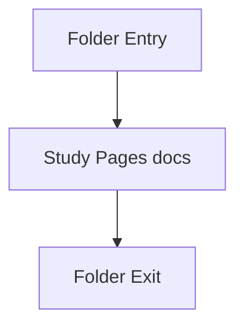

# pages

- Folder: docs/Codebase/Frontend/pages
- Descendant source docs: 6
- Generated on: 2026-04-23

## Logic Summary
Route-sized HTML fragments for the user-facing microservice workflow, including the live class-analysis workspace.

## Subsystem Story
This folder is mostly leaf-level. The local documents explain the screens a user moves through while typing class declarations, waiting for backend analysis, inspecting documentation targets, reviewing unit-test targets, and downloading output when batch artifacts are available.

## Folder Flow

## Documents By Logic
### Pages
These documents explain the route fragments that the client-side router injects into the main content area.
- dashboard.html.md : Shows job summaries and entry points into the microservice workflow.
- analysis-new.html.md : Hosts the live editor, trigger state, diagnostics, documentation targets, unit-test targets, and AI documentation preview.
- results.html.md : Summarizes completed microservice output and links to artifacts.
- diff-viewer.html.md : Displays source, diff, parse-tree, and report artifacts.
- fix-suggestions.html.md : Legacy page for returned fix candidates; live documentation flow should prefer documentation and unit-test target language.
- download.html.md : Exposes generated output artifacts for download.

## Reading Hint
- Read these pages in workflow order: dashboard, analysis-new, results, diff-viewer, fix-suggestions, download.

