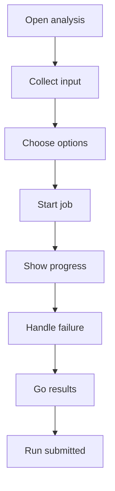

# analysis-new.html

- Source: Frontend/pages/analysis-new.html
- Kind: HTML view

## Story
### What Happens Here

This page fragment captures source input and starts the backend transform workflow. It should collect the file or project input, show accepted options, and hand the request to frontend scripts that call the backend route responsible for microservice orchestration.

### Why It Matters In The Flow

Loaded when the user starts a new analysis. It is the user-facing handoff from UI intent to backend and microservice execution.

### What To Watch While Reading

Keep this page focused on input collection, start controls, progress display, and error presentation. It should not contain analysis rules, AST logic, or transform decisions.

## Program Flow
This diagram follows the action path in plain words. Decision diamonds show where the file can stop, branch, or repeat work instead of simply passing through a straight line.

## Reading Map
Read this file as: Captures source input and starts a backend transform job.

Where it sits in the run: Loaded between the dashboard and the backend job creation call.

Names worth recognizing while reading: #ready-card, #progress-card, #prog-pct-1, #prog-bar-1, #prog-pct-2, and #prog-bar-2.

It leans on nearby contracts or tools such as #/dashboard.

## Documentation Note
- This markdown file is part of the generated docs/Codebase mirror.
- It was generated from the repository state on 2026-04-23 after reading the existing docs corpus and the current source tree.

