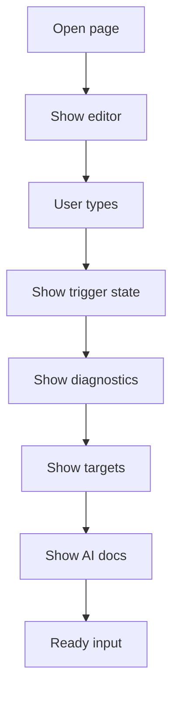

# analysis-new.html

- Source: `Frontend/pages/analysis-new.html`
- Kind: HTML view

## Story
### What Happens Here

This page is the live class-analysis workspace. It should provide the editor surface, status area, diagnostics area, documentation-target list, unit-test-target list, and AI documentation preview.

The page no longer asks the user for source pattern, target pattern, source input, or output selection. The backend detects the design-pattern evidence by cross-referencing the completed class subtree with the wider analysis model.

### Why It Matters In The Flow

This page is where the user types code in real time. It must feel responsive without making the parser run on every keystroke. It therefore delegates trigger logic to `analysis.js` and backend calls to `api.js`.

### What To Watch While Reading

Keep visible labels aligned with the new product behavior:
- use `Detected pattern`, not `Source` and `Target`.
- use `Documentation targets`, not `Refactor candidates`.
- use `Unit-test targets`, not `Fix suggestions`, for this flow.

## Page Flow

## Required Page Regions

- Editor region: code textarea or editor component for C++ class declarations.
- Trigger status: `Typing`, `Waiting for complete class`, `Analyzing`, or `Complete`.
- Diagnostics: lexical and subtree errors returned by backend.
- Detected pattern summary: pattern name, confidence if available, and evidence count.
- Documentation targets: code units that the algorithm says should be documented.
- Unit-test targets: code units that need generated test-case coverage.
- AI documentation preview: generated documentation or pending status.

## UI Ownership Boundary

This page owns DOM structure only. It does not contain:
- class-boundary scanner logic.
- backend fetch logic.
- lexical analysis.
- subtree construction.
- AI prompt assembly.
- report JSON schema mapping.

## Acceptance Checks

- The page has no source-pattern or target-pattern selection.
- The page has no source-output or transform-output selector.
- The page does not display refactor terminology.
- The page includes visible space for documentation targets and unit-test targets.
- The page can show backend diagnostics without navigating away.
