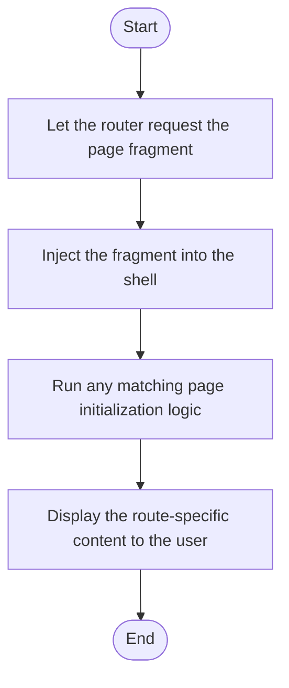

# dashboard.html

- Source: Frontend/pages/dashboard.html
- Kind: HTML view
- Lines: 87
- Role: Provides a page fragment that the client-side router injects into the main content area.
- Chronology: Loaded after the router selects a route and injects the fragment into the shell document.

## Notable Symbols
- This artifact is primarily declarative or inline and does not expose many named symbols.

## Direct Dependencies
- #/analysis/new

## Implementation Story
This page fragment implements one route-sized screen inside the frontend shell. The router fetches it on demand, injects it into the main content container, and then lets the page-specific scripts bring it to life. Provides a page fragment that the client-side router injects into the main content area. Loaded after the router selects a route and injects the fragment into the shell document. In practice it collaborates directly with #/analysis/new.

## Activity Diagram

## Documentation Note
- This markdown file is part of the generated docs/Codebase mirror.
- It was generated from the repository state on 2026-04-22 after reading the existing docs corpus and the current source tree.

