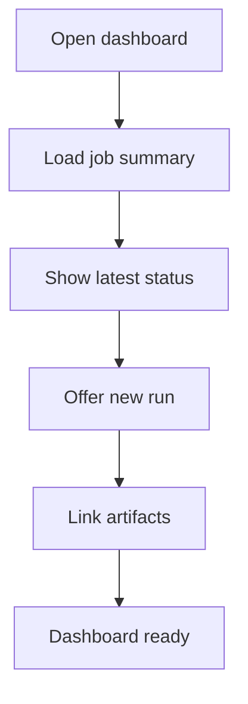

# dashboard.html

- Source: Frontend/pages/dashboard.html
- Kind: HTML view

## Story
### What Happens Here

This page fragment is the landing dashboard for the microservice workflow. It should summarize recent or active backend transform jobs, expose the new-analysis entry point, and keep the user oriented around generated artifacts rather than local placeholder content.

### Why It Matters In The Flow

Loaded after the router selects the dashboard route. It is the normal place to start a new microservice run or return to the latest result.

### What To Watch While Reading

This page should present backend job state and high-level result status. It should not compute analysis metrics locally.

## Program Flow
This diagram follows the action path in plain words. Decision diamonds show where the file can stop, branch, or repeat work instead of simply passing through a straight line.

## Reading Map
Read this file as: Shows job summaries and entry points into the microservice workflow.

Where it sits in the run: Loaded before starting or resuming a backend transform job.

It leans on nearby contracts or tools such as #/analysis/new.

## Documentation Note
- This markdown file is part of the generated docs/Codebase mirror.
- It was generated from the repository state on 2026-04-23 after reading the existing docs corpus and the current source tree.

