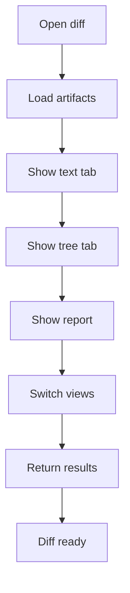

# diff-viewer.html

- Source: Frontend/pages/diff-viewer.html
- Kind: HTML view

## Story
### What Happens Here

This page fragment displays detailed comparison artifacts from a completed microservice run. It should provide the tabs and containers for original source, transformed source, parse-tree views, and report-backed diff output.

### Why It Matters In The Flow

Loaded after results are available and the user wants to inspect what changed.

### What To Watch While Reading

The page owns display structure only. The source text, tree data, and diff facts should come from backend or microservice artifacts.

## Program Flow
This diagram follows the action path in plain words. Decision diamonds show where the file can stop, branch, or repeat work instead of simply passing through a straight line.

## Reading Map
Read this file as: Displays source, diff, parse-tree, and report artifacts.

Where it sits in the run: Loaded after result artifacts are available.

Names worth recognizing while reading: #icon-code, #icon-graph, #tab-text, #tab-ast, #text-diff-view, and #original-code.

It leans on nearby contracts or tools such as #/results.

## Documentation Note
- This markdown file is part of the generated docs/Codebase mirror.
- It was generated from the repository state on 2026-04-23 after reading the existing docs corpus and the current source tree.

