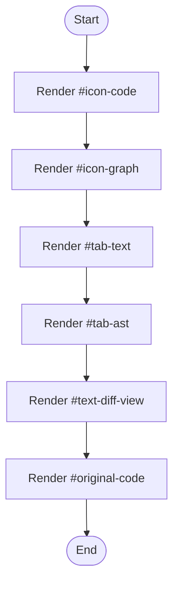

# diff-viewer.html

- Source: Frontend/pages/diff-viewer.html
- Kind: HTML view
- Lines: 131
- Role: Provides a page fragment that the client-side router injects into the main content area.
- Chronology: Loaded after the router selects a route and injects the fragment into the shell document.

## Notable Symbols
- #icon-code
- #icon-graph
- #tab-text
- #tab-ast
- #text-diff-view
- #original-code
- #transformed-code
- #ast-view

## Direct Dependencies
- #/results

## File Outline
### Responsibility

This page fragment implements one route-sized screen inside the frontend shell. The router fetches it on demand, injects it into the main content container, and then lets the page-specific scripts bring it to life.

### Position In The Flow

Loaded after the router selects a route and injects the fragment into the shell document.

### Main Surface Area

Provides a page fragment that the client-side router injects into the main content area. The main surface area is easiest to track through symbols such as #icon-code, #icon-graph, #tab-text, and #tab-ast. It collaborates directly with #/results.

## File Activity

## Documentation Note
- This markdown file is part of the generated docs/Codebase mirror.
- It was generated from the repository state on 2026-04-23 after reading the existing docs corpus and the current source tree.

