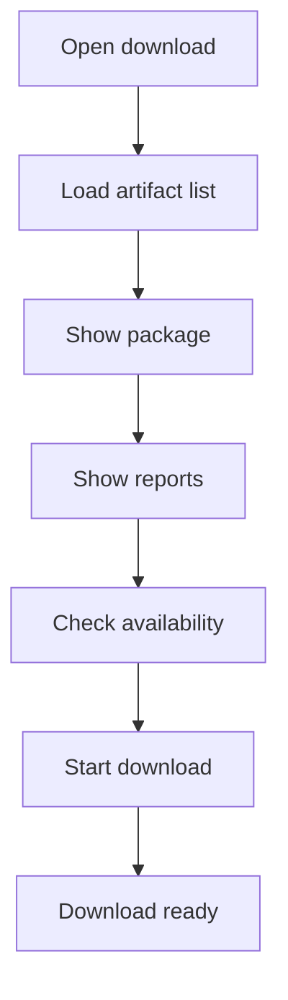

# download.html

- Source: Frontend/pages/download.html
- Kind: HTML view

## Story
### What Happens Here

This page fragment exposes generated output artifacts for download. It should list the microservice output package, report files, transformed source, and supporting views that the backend makes available.

### Why It Matters In The Flow

Loaded after results or fix review when the user wants to retrieve generated artifacts.

### What To Watch While Reading

The page should trust backend-provided artifact metadata, sizes, and URLs. It should not create output files locally beyond triggering browser downloads.

## Program Flow
This diagram follows the action path in plain words. Decision diamonds show where the file can stop, branch, or repeat work instead of simply passing through a straight line.

## Reading Map
Read this file as: Exposes generated output artifacts for download.

Where it sits in the run: Loaded after microservice artifacts are produced.

It leans on nearby contracts or tools such as #/results.

## Documentation Note
- This markdown file is part of the generated docs/Codebase mirror.
- It was generated from the repository state on 2026-04-23 after reading the existing docs corpus and the current source tree.

