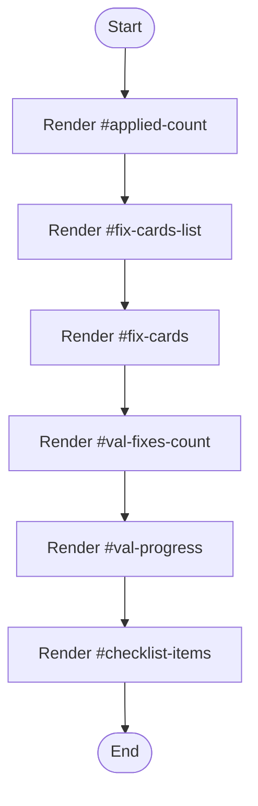

# fix-suggestions.html

- Source: Frontend/pages/fix-suggestions.html
- Kind: HTML view
- Lines: 97
- Role: Provides a page fragment that the client-side router injects into the main content area.
- Chronology: Loaded after the router selects a route and injects the fragment into the shell document.

## Notable Symbols
- #applied-count
- #fix-cards-list
- #fix-cards
- #val-fixes-count
- #val-progress
- #checklist-items
- #apply-all-btn
- #reset-btn

## Direct Dependencies
- #/results

## Implementation Story
This page fragment implements one route-sized screen inside the frontend shell. The router fetches it on demand, injects it into the main content container, and then lets the page-specific scripts bring it to life. Provides a page fragment that the client-side router injects into the main content area. Loaded after the router selects a route and injects the fragment into the shell document. The implementation surface is easiest to recognize through symbols such as #applied-count, #fix-cards-list, #fix-cards, and #val-fixes-count. In practice it collaborates directly with #/results.

## Activity Diagram

## Documentation Note
- This markdown file is part of the generated docs/Codebase mirror.
- It was generated from the repository state on 2026-04-22 after reading the existing docs corpus and the current source tree.

