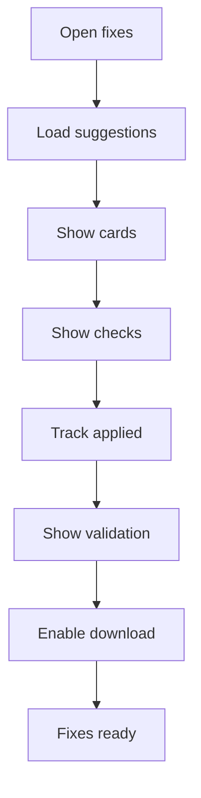

# fix-suggestions.html

- Source: Frontend/pages/fix-suggestions.html
- Kind: HTML view

## Story
### What Happens Here

This page fragment displays fix candidates and validation checks returned by the backend or microservice report. It should help the user review generated suggestions, understand acceptance status, and proceed to download when the output is ready.

### Why It Matters In The Flow

Loaded after results are available and the user wants to review suggested remediation or transform output.

### What To Watch While Reading

Keep the page as a review surface. It should not decide rule correctness or generate fixes locally.

## Program Flow
This diagram follows the action path in plain words. Decision diamonds show where the file can stop, branch, or repeat work instead of simply passing through a straight line.

## Reading Map
Read this file as: Displays returned fix candidates and validation checks.

Where it sits in the run: Loaded after result artifacts are available and before download.

Names worth recognizing while reading: #applied-count, #fix-cards-list, #fix-cards, #val-fixes-count, #val-progress, and #checklist-items.

It leans on nearby contracts or tools such as #/results.

## Documentation Note
- This markdown file is part of the generated docs/Codebase mirror.
- It was generated from the repository state on 2026-04-23 after reading the existing docs corpus and the current source tree.

