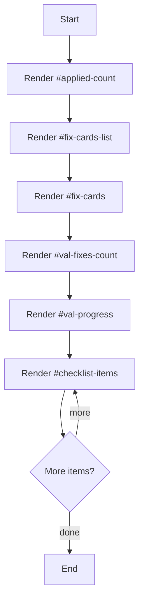

# fix-suggestions.html

- Source: Frontend/pages/fix-suggestions.html
- Kind: HTML view
- Lines: 97

## Story
### What Happens Here

This page fragment implements one route-sized screen inside the frontend shell. The router fetches it on demand, injects it into the main content container, and then lets the page-specific scripts bring it to life.

### Why It Matters In The Flow

Loaded after the router selects a route and injects the fragment into the shell document.

### What To Watch While Reading

Provides a page fragment that the client-side router injects into the main content area. The main surface area is easiest to track through symbols such as #applied-count, #fix-cards-list, #fix-cards, and #val-fixes-count. It collaborates directly with #/results.

## Program Flow
This diagram follows the action path in plain words. Decision diamonds show where the file can stop, branch, or repeat work instead of simply passing through a straight line.

## Reading Map
Read this file as: Provides a page fragment that the client-side router injects into the main content area.

Where it sits in the run: Loaded after the router selects a route and injects the fragment into the shell document.

Names worth recognizing while reading: #applied-count, #fix-cards-list, #fix-cards, #val-fixes-count, #val-progress, and #checklist-items.

It leans on nearby contracts or tools such as #/results.

## Documentation Note
- This markdown file is part of the generated docs/Codebase mirror.
- It was generated from the repository state on 2026-04-23 after reading the existing docs corpus and the current source tree.

