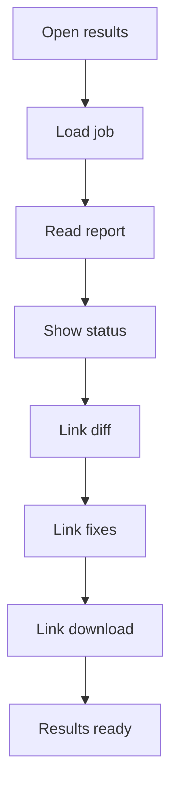

# results.html

- Source: Frontend/pages/results.html
- Kind: HTML view

## Story
### What Happens Here

This page fragment summarizes the completed backend transform job and the artifacts produced by the C++ microservice. It should show run status, report highlights, artifact availability, and navigation into diff, fix, and download screens.

### Why It Matters In The Flow

Loaded after the backend reports that the microservice run completed or failed. It is the main result landing page.

### What To Watch While Reading

Keep this page as a summary of returned data. It should link to details rather than recompute or reinterpret microservice output.

## Program Flow
This diagram follows the action path in plain words. Decision diamonds show where the file can stop, branch, or repeat work instead of simply passing through a straight line.

## Reading Map
Read this file as: Summarizes completed microservice output and links to artifacts.

Where it sits in the run: Loaded after backend job completion.

It leans on nearby contracts or tools such as #/dashboard.

## Documentation Note
- This markdown file is part of the generated docs/Codebase mirror.
- It was generated from the repository state on 2026-04-23 after reading the existing docs corpus and the current source tree.

