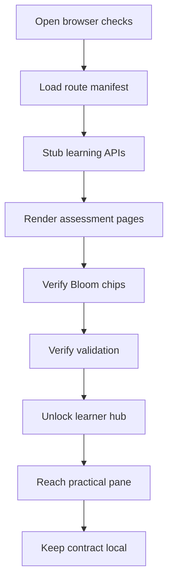

# playwright

- Folder: docs/Codebase/Frontend/playwright
- Owner: Frontend

## Logic Summary
Local browser checks for the frontend learning surfaces and the studio. This folder documents the Playwright coverage contract, the route manifest rows the smoke relies on, and the small amount of API mocking used to keep learner assessment tests deterministic.

## Ownership Boundary
This folder owns browser test intent, route coverage notes, and local run guidance only. It must not own application logic, backend persistence, or generated data. The code under `Codebase/Frontend/playwright/` remains the executable source of truth.

## Subsystem Story
Read `tests/learner-assessment.spec.ts.md` first for the assessment-route and learning-hub smoke checks. Use the repository-level `tests/routes.manifest.json` alongside it when you need the shared route contract.

## Folder Flow

## Documents By Logic
### Test Coverage
- `tests/learner-assessment.spec.ts.md` - route smoke for the three assessment pages plus the unlocked learner-hub practical path.

## Reading Hint
- Use the manifest for route ownership and the spec doc for browser behavior. The tests are intentionally small and API-mocked so they can run against a Vite dev server without the backend.
