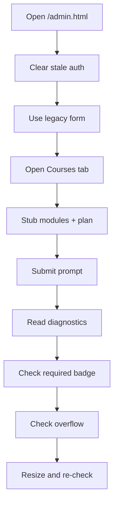

# `admin-courses.spec.ts`

## Sole job

Cover the admin Courses planner with one deterministic browser path: sign in through the visible legacy admin form, open the Courses tab, submit a prompt, and verify the AI preview, required section, and responsive overflow behavior.

## Run Shape

The spec runs against the local frontend base URL from Playwright config or `PLAYWRIGHT_BASE_URL`, then opens the admin SPA at `/admin.html`. It keeps the visible legacy sign-in form, but stubs the login, health, admin-user, admin-learning-module, and `/api/admin/course-plan` requests so the planner output stays deterministic without a backend.

## Program Flow

## Contract Notes

- The spec uses the existing `admin-courses` and `course-plan-panel` test ids.
- The admin entrypoint is `/admin.html`; `/admin` is not the page the browser test should target.
- The prompt field, diagnostics strip, board, and required section are located by label, role, and visible text because the frontend has not yet exposed dedicated test ids for those subregions.
- Expected test ids from the frontend worker, if added later, would be most useful for the prompt textarea, submit button, diagnostics strip, AI board, and required-learning block.
- The course-plan mock keeps the top AI board free of foundation rows by returning only non-foundation modules in the module list, while the required section still includes the required foundations.

## Acceptance Checks

- The legacy admin login form accepts `Neoterritory` / `ragabag123`.
- The Courses tab opens and the planner panel is visible.
- POST `/api/admin/course-plan` returns a deterministic AI preview with `aiValidation passed` and `patternDiversity`.
- The AI board shows Repository, State, and Strategy.
- The AI board does not show the required foundation module title.
- The AI board and required-learning section do not surface the word `baseline` in visible content.
- The required-learning section shows the `required` badge for the foundation module.
- The desktop layout does not overflow horizontally.
- A mobile-sized viewport also stays within horizontal bounds.
