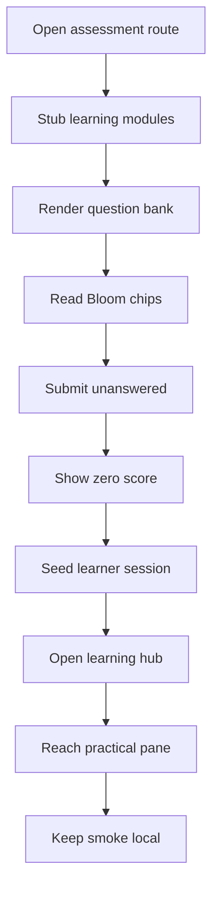

# `learner-assessment.spec.ts`

## Sole job

Cover the assessment routes and the practical learner-hub smoke path with deterministic browser checks. The spec verifies three public assessment routes, checks the canonical 25-module baseline, confirms Bloom taxonomy chips and question controls render, and proves unanswered submissions receive a server-style `0/25` result.

## Run Shape

The spec is designed to run against a local frontend server only. It mocks the learning-module and learning-assessment endpoints and serves the same 25 published modules encoded by the seed baseline.

## Program Flow

## Route Coverage

### Assessment routes

- `/pre-test`
- `/post-test`
- `/post-test-2`

Each route should render its own page shell, the question list, and the taxonomy chips.

### Learner hub smoke

- `/patterns/learn`
- unlocked with `nt_token`, `nt_user`, and `nt_learning_unlock_all=1`
- confirms the sidebar can reach a practical exam pane without a live backend

## Acceptance Checks

- The assessment routes render `data-testid="pretest-page"`, `posttest-page`, and `posttest2-page`.
- The question list is visible on each route.
- Every rendered taxonomy chip carries a valid Bloom taxonomy value.
- Every assessment category renders exactly 25 taxonomy-tagged questions.
- Clicking submit with unanswered questions shows `0/25`.
- The unlocked learner hub can open a practical exam section and show the practical target block.
