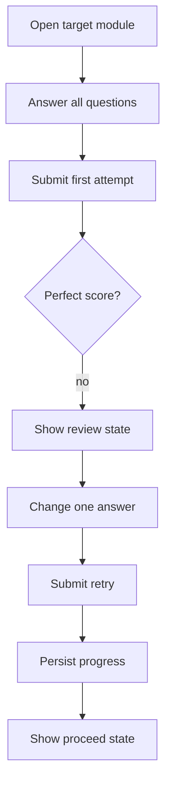
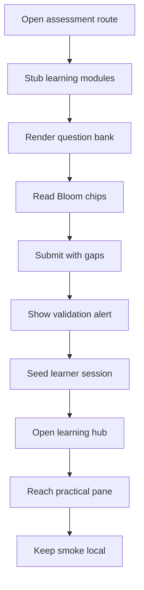

# `learner-assessment.spec.ts`

## Conceptual assessment regression

The Learning Path browser regression uses a three-module mocked curriculum to verify the complete conceptual submission boundary:

- an already-completed module renders the themed check SVG
- a future module renders the themed lock SVG
- Submit is disabled until every conceptual question is answered
- a non-perfect attempt records `5 / 6`, leaves progress unchanged, and shows the review-required status
- revising without changing the submitted answers keeps Submit disabled
- changing the incorrect answer enables one new attempt
- a perfect `6 / 6` attempt writes learning progress and shows the proceed-to-next-module status

## Sole job

Cover the assessment routes and the practical learner-hub smoke path with deterministic browser checks. The spec verifies three public assessment routes, checks that the rendered question cards include Bloom taxonomy chips, confirms incomplete submission shows the browser-side validation message, and proves the unlocked learning path can reach a practical exam pane.

## Run Shape

The spec is designed to run against a local frontend server only. It mocks the learning-module and learning-assessment endpoints that would otherwise depend on a backend, then relies on the bundled learning catalog fallback for the question data.

## Program Flow

## Route Coverage

### Assessment routes

- `/pre-test`
- `/post-test`
- `/post-test-2`

Each route should render its own page shell, the question list, and the taxonomy chips.

### Learner hub smoke

- `/patterns/learn`
- unlocked with `nt_token`, `nt_user`, and `nt_learning_unlock_all=1`
- confirms the sidebar can reach a practical exam pane without a live backend

## Acceptance Checks

- The assessment routes render `data-testid="pretest-page"`, `posttest-page`, and `posttest2-page`.
- The question list is visible on each route.
- Every rendered taxonomy chip carries a valid Bloom taxonomy value.
- Clicking submit with unanswered questions shows `Answer every question before submitting.`
- The unlocked learner hub can open a practical exam section and show the practical target block.
