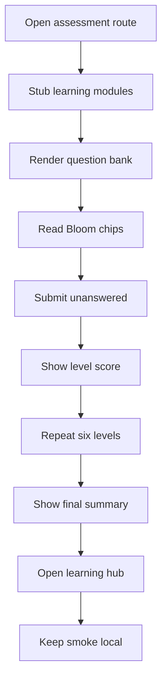

# `learner-assessment.spec.ts`

## Sole job

Cover the assessment routes and personalized learner-hub smoke path with deterministic browser checks. The spec verifies three assessment routes, checks the canonical 25-module baseline, and exercises the complete six-level pre-test through its final Learner Path redirect.

It also verifies localhost learner access without Google or an available shared guest seat.

## Run Shape

The spec is designed to run against a local frontend server only. It mocks the learning-module and learning-assessment endpoints and serves the same 25 published modules encoded by the seed baseline.

## Program Flow

## Route Coverage

### Assessment routes

- `/pre-test`
- `/post-test`
- `/post-test-2`

Each route should render its own page shell, the question list, and the taxonomy chips.

### Learner hub smoke

- `/patterns/learn`
- authenticated with `nt_token` and `nt_user`
- seeded with fresh saved pre-test evidence
- confirms the personalized module sidebar renders without a live backend

## Acceptance Checks

- The assessment routes render `data-testid="pretest-page"`, `posttest-page`, and `posttest2-page`.
- The question list is visible on each route.
- Every rendered taxonomy chip carries a valid Bloom taxonomy value.
- Every assessment category renders exactly 25 taxonomy-tagged questions.
- Clicking submit with unanswered questions shows `0/25`.
- The six Bloom levels cannot be skipped and each shows its own mocked score.
- The complete pre-test persists 150 answers and renders six summary rows.
- Continue after the summary opens `/patterns/learn`.
- `Continue as Test Intern` creates a local learner session, reaches `/pre-test`, and survives reload.
- Fresh saved pre-test history opens the personalized Learner Path and its module sidebar.
