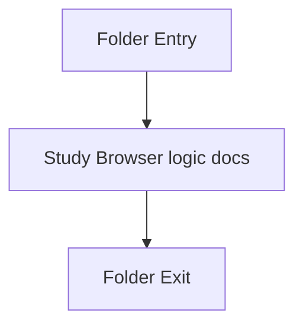

# scripts

- Folder: docs/Codebase/Frontend/scripts
- Descendant source docs: 6
- Generated on: 2026-04-23

## Logic Summary
Browser logic that powers routing, backend communication, live class-boundary triggering, microservice artifact rendering, and page interactions.

## Subsystem Story
This folder is mostly leaf-level. The local documents here carry the main explanation of browser coordination. Keep frontend scripts focused on presentation, complete-class trigger detection, and transport. Lexical analysis, subtree construction, pattern detection, AI documentation, unit-test generation, and report output remain backend or microservice concerns.

## Folder Flow

## Documents By Logic
### Browser Logic
These documents explain the local implementation by covering route behavior, backend contracts, and rendering of returned microservice artifacts.
- analysis.js.md : Waits for a complete class declaration before asking the backend to analyze the live editor slice.
- api.js.md : Owns the browser-to-backend contract for live class analysis and normalized diagnostics.
- diff-viewer.js.md : Renders source and AST artifacts returned by the backend or microservice.
- fix-suggestions.js.md : Renders microservice-provided fix candidates and validation checks.
- router.js.md : Drives hash routing, fragment loading, and page-init hooks.
- sidebar.js.md : Controls navigation state, mobile sidebar behavior, and theme toggling.

## Reading Hint
- Read `analysis.js.md` before `api.js.md` for the trigger rules, then read `api.js.md` for the backend request shape.

