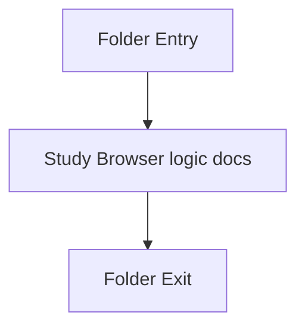

# scripts

- Folder: docs/Codebase/Frontend/scripts
- Descendant source docs: 6
- Generated on: 2026-04-23

## Logic Summary
Browser logic that powers routing, UI state changes, mock data usage, and page interactions.

## Subsystem Story
This folder is mostly leaf-level. The local documents here carry the main explanation of the subsystem without requiring much extra descent.

## Folder Flow

## Documents By Logic
### Browser Logic
These documents explain the local implementation by covering Implements page-level interactive behavior for the static frontend. and Supplies mock data that feeds the current frontend experience.
- analysis.js.md : Implements page-level interactive behavior for the static frontend.
- api.js.md : Supplies mock data that feeds the current frontend experience.
- diff-viewer.js.md : Implements page-level interactive behavior for the static frontend.
- fix-suggestions.js.md : Implements page-level interactive behavior for the static frontend.
- router.js.md : Drives hash routing, fragment loading, and page-init hooks.
- sidebar.js.md : Controls navigation state, mobile sidebar behavior, and theme toggling.

## Reading Hint
- This folder is mostly leaf-level. Read the local file docs to understand the logic in this area.

