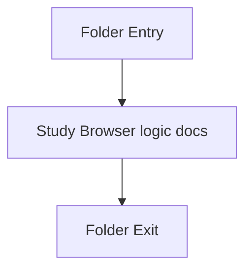

# scripts

- Folder: docs/Codebase/Frontend/scripts
- Descendant source docs: 6
- Generated on: 2026-04-23

## Logic Summary
Browser logic that powers routing, backend communication, job-progress display, microservice artifact rendering, and page interactions.

## Subsystem Story
This folder is mostly leaf-level. The local documents here carry the main explanation of browser coordination. Keep frontend scripts focused on presentation and transport. Parsing, pattern detection, transform rules, and output generation remain backend or microservice concerns.

## Folder Flow

## Documents By Logic
### Browser Logic
These documents explain the local implementation by covering route behavior, backend contracts, and rendering of returned microservice artifacts.
- analysis.js.md : Starts a backend transform job and displays job progress for the microservice run.
- api.js.md : Owns the browser-to-backend contract for transform jobs and artifact retrieval.
- diff-viewer.js.md : Renders source and AST artifacts returned by the backend or microservice.
- fix-suggestions.js.md : Renders microservice-provided fix candidates and validation checks.
- router.js.md : Drives hash routing, fragment loading, and page-init hooks.
- sidebar.js.md : Controls navigation state, mobile sidebar behavior, and theme toggling.

## Reading Hint
- Read `api.js.md` before the page scripts. It defines how frontend state should map to backend jobs and microservice artifacts.

