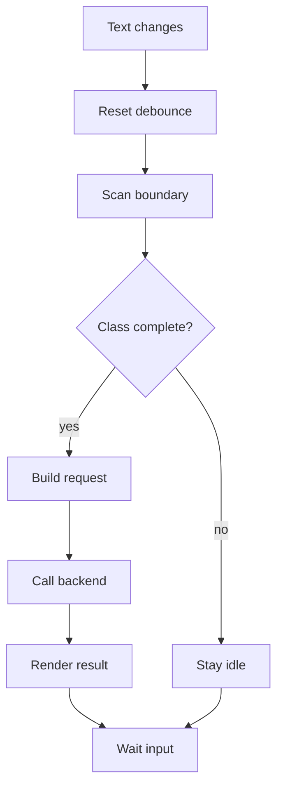
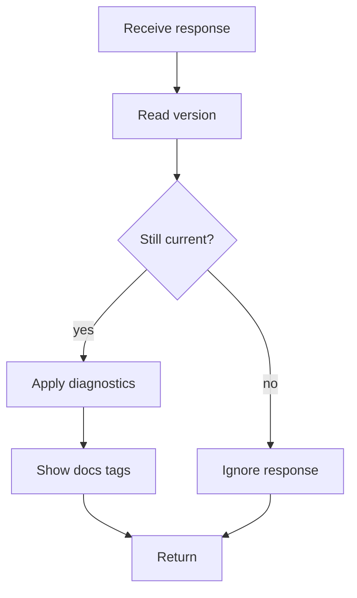

# analysis.js

- Source: `Frontend/scripts/analysis.js`
- Kind: JavaScript module

## Story
### What Happens Here

This script owns the live editor trigger for analysis. It watches source text changes, waits for typing to settle, checks whether the current text contains a complete class or struct declaration, and calls the backend only when that declaration can form a stable subtree.

The frontend does not run the real lexer, parser, design-pattern detector, documentation generator, or unit-test generator. It only performs a cheap boundary check so the backend is not called while the user is still inside an unfinished class declaration.

### Why It Matters In The Flow

The backend and microservice need a complete subtree before lexical analysis and documentation tagging can produce useful results. This script prevents every-keystroke parsing while preserving the near-real-time feel of the editor.

### What To Watch While Reading

Keep three states separate:
- `typing`: user input is changing and no backend call should start yet.
- `waiting_for_class_boundary`: debounce elapsed, but the class declaration is still incomplete.
- `analysis_pending`: a complete class declaration was sent to the backend for lexical analysis, subtree building, AI documentation, and unit-test target generation.

## Program Flow
The script first guards the backend call with a debounce and class-boundary detector. The backend remains the authority on syntax and pattern evidence.



## Boundary Detector

The detector should be lightweight and intentionally conservative. It should only answer whether a class declaration appears complete enough to send to the backend.

Expected checks:
- `class` or `struct` keyword is present.
- A valid-looking class name follows the keyword.
- The declaration has an opening brace.
- Braces are balanced outside comments and string literals.
- The class declaration closes with `};`.

The detector should return:
- `complete`: boolean.
- `range`: start and end offsets for the detected declaration.
- `className`: best-effort class or struct name.
- `reason`: short status for UI text.

## Stale Response Guard

Every request must include `documentVersion`. The script increments this version on each input change and ignores any backend response whose version is older than the current editor state.



## Backend Payload

`analysis.js` should call `api.js` with a payload shaped like this:

```json
{
  "documentId": "active-editor",
  "documentVersion": 17,
  "className": "Factory",
  "classRange": {
    "startOffset": 128,
    "endOffset": 615
  },
  "code": "class Factory { ... };"
}
```

Do not send source-pattern, target-pattern, source-output, or requested refactor values. Pattern detection must come from backend and microservice cross-referencing.

## Response Handling

The UI should display:
- lexical diagnostics when tokens are invalid.
- subtree diagnostics when the class cannot be parsed into a stable subtree.
- detected design-pattern evidence when cross-referencing succeeds.
- documentation targets returned by the backend.
- unit-test targets returned by the backend.
- AI documentation status or draft text when available.

## Acceptance Checks

- No backend request is sent while the class declaration is missing its closing `};`.
- Typing again while a request is pending increments `documentVersion`.
- Older responses do not update the screen.
- The frontend does not ask for source or target patterns.
- The frontend does not use refactor language for documentation targets.
