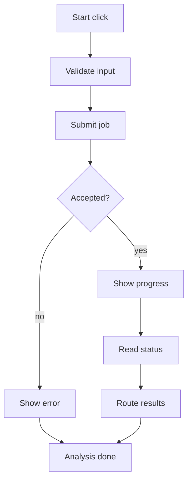
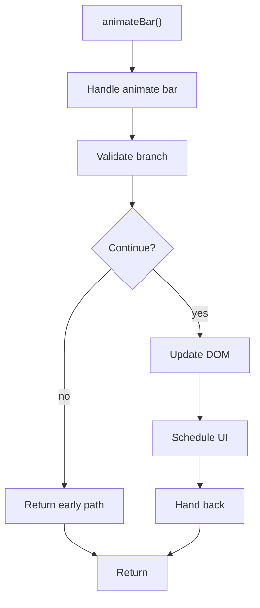

# analysis.js

- Source: Frontend/scripts/analysis.js
- Kind: JavaScript module

## Story
### What Happens Here

This file owns the analysis-start interaction on the frontend. It reacts to the start action, gathers the selected input and options from the page, asks `api.js` to create a backend transform job, reflects backend progress, and routes to results when the microservice artifacts are ready.

### Why It Matters In The Flow

Runs at the handoff from user intent to backend orchestration. It should show progress, errors, and completion state without simulating microservice decisions as business logic.

### What To Watch While Reading

Keep UI animation separate from job truth. Progress bars may smooth the experience, but completion, failure, and artifact availability should come from the backend job state.

## Program Flow
This diagram follows the action path in plain words. Decision diamonds show where the file can stop, branch, or repeat work instead of simply passing through a straight line.

## Reading Map
Read this file as: Starts backend transform jobs and displays microservice run progress.

Where it sits in the run: Runs after the analysis page loads and before result artifacts are inspected.

Names worth recognizing while reading: animateBar, btn, readyCard, progressCard, current, and interval.

## Story Groups

### Supporting Steps
These steps support the local behavior of the file.
- animateBar(): Validate conditions and branch on failures, update DOM state, and schedule UI updates

## Function Stories

### animateBar()
This routine owns one focused piece of the file's behavior.

Inside the body, it mainly handles validate conditions and branch on failures, update DOM state, and schedule UI updates.

It branches on runtime conditions instead of following one fixed path.

What it does:
- validate conditions and branch on failures
- update DOM state
- schedule UI updates

Flow:

## Documentation Note
- This markdown file is part of the generated docs/Codebase mirror.
- It was generated from the repository state on 2026-04-23 after reading the existing docs corpus and the current source tree.

