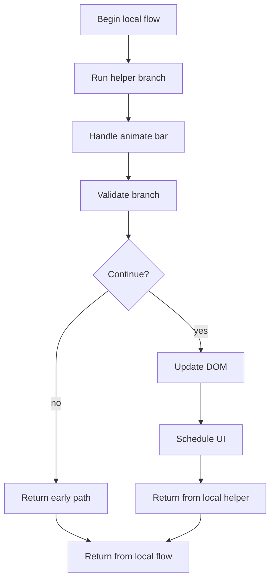
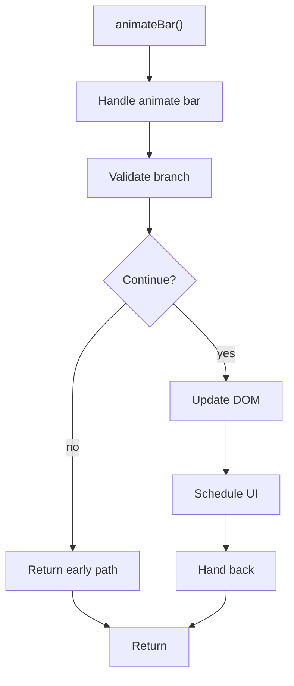

# analysis.js

- Source: Frontend/scripts/analysis.js
- Kind: JavaScript module

## Story
### What Happens Here

This file implements the staged-analysis demo flow on the frontend. It reacts to the start button, swaps ready and progress states, animates the progress bars, and navigates to the results view when the simulated pipeline finishes. This script implements one piece of the frontend interaction model. It runs inside the browser after the SPA shell loads and updates the page in response to routing or user actions.

### Why It Matters In The Flow

Runs in the browser while the user navigates the prototype UI.

### What To Watch While Reading

Implements page-level interactive behavior for the static frontend. The main surface area is easiest to track through symbols such as animateBar, btn, readyCard, and progressCard.

## Program Flow
This diagram follows the action path in plain words. Decision diamonds show where the file can stop, branch, or repeat work instead of simply passing through a straight line.

## Reading Map
Read this file as: Implements page-level interactive behavior for the static frontend.

Where it sits in the run: Runs in the browser while the user navigates the prototype UI.

Names worth recognizing while reading: animateBar, btn, readyCard, progressCard, current, and interval.

## Story Groups

### Supporting Steps
These steps support the local behavior of the file.
- animateBar(): Validate conditions and branch on failures, update DOM state, and schedule UI updates

## Function Stories

### animateBar()
This routine owns one focused piece of the file's behavior.

Inside the body, it mainly handles validate conditions and branch on failures, update DOM state, and schedule UI updates.

It branches on runtime conditions instead of following one fixed path.

What it does:
- validate conditions and branch on failures
- update DOM state
- schedule UI updates

Flow:

## Documentation Note
- This markdown file is part of the generated docs/Codebase mirror.
- It was generated from the repository state on 2026-04-23 after reading the existing docs corpus and the current source tree.

