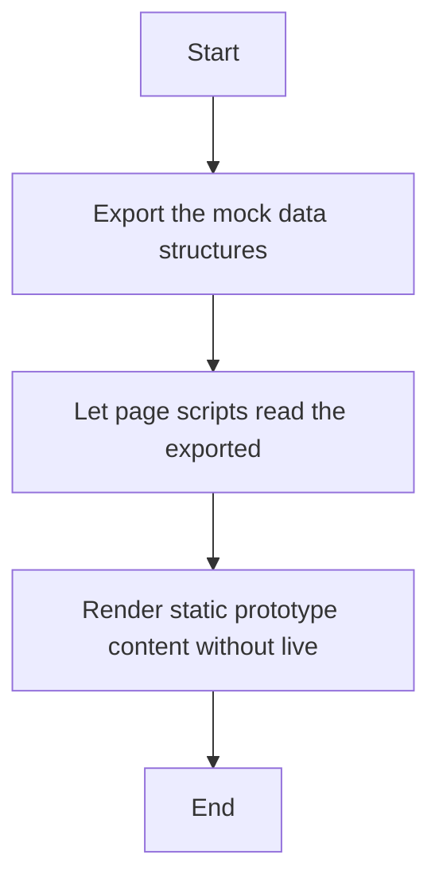

# api.js

- Source: Frontend/scripts/api.js
- Kind: JavaScript module
- Lines: 179

## Story
### What Happens Here

This file implements the mock-data contract for the current frontend. Instead of calling a live backend, the pages pull their dashboard, diff, fixes, and download content from the exported in-memory structures defined here. This script implements one piece of the frontend interaction model. It runs inside the browser after the SPA shell loads and updates the page in response to routing or user actions.

### Why It Matters In The Flow

Runs in the browser while the user navigates the prototype UI.

### What To Watch While Reading

Supplies mock data that feeds the current frontend experience.

## Program Flow
This diagram follows the action path in plain words. Decision diamonds show where the file can stop, branch, or repeat work instead of simply passing through a straight line.

## Reading Map
Read this file as: Supplies mock data that feeds the current frontend experience.

Where it sits in the run: Runs in the browser while the user navigates the prototype UI.

## Documentation Note
- This markdown file is part of the generated docs/Codebase mirror.
- It was generated from the repository state on 2026-04-23 after reading the existing docs corpus and the current source tree.

