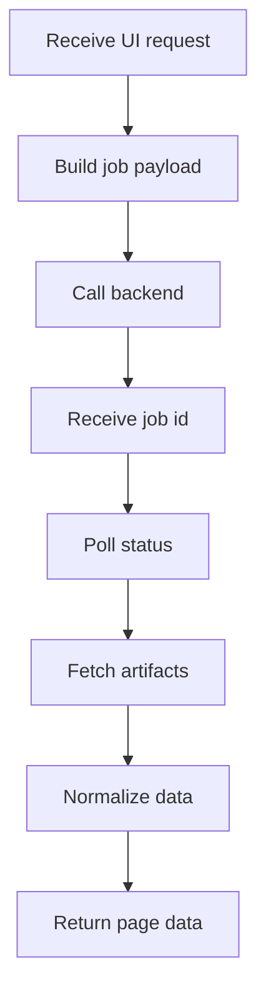

# api.js

- Source: Frontend/scripts/api.js
- Kind: JavaScript module

## Story
### What Happens Here

This file is the intended browser-to-backend contract for the frontend. During the temporary compatibility phase it may still expose local placeholder structures, but its target responsibility is to submit transform jobs, poll job status, fetch microservice artifacts, and normalize response shapes for page scripts.

### Why It Matters In The Flow

Runs in the browser between route-level UI code and the backend transform API. It prevents page scripts from inventing microservice state or duplicating analysis logic.

### What To Watch While Reading

Keep this file as the only frontend boundary that knows backend endpoint shapes. The backend should own file persistence and process orchestration. The C++ microservice should own parsing, pattern detection, diff/report generation, documentation tagging, and generated output.

## Program Flow
This diagram follows the action path in plain words. Decision diamonds show where the file can stop, branch, or repeat work instead of simply passing through a straight line.

## Reading Map
Read this file as: Owns the browser contract for transform jobs and artifact retrieval.

Where it sits in the run: Runs after page actions and before backend responses are rendered.

## Migration Notes

- Replace mock exports with backend-backed functions without changing page ownership.
- Keep request payloads aligned with backend transform docs.
- Treat microservice outputs as immutable artifacts for rendering.
- Do not implement pattern detection, AST generation, or transform rules in this file.

## Documentation Note
- This markdown file is part of the generated docs/Codebase mirror.
- It was generated from the repository state on 2026-04-23 after reading the existing docs corpus and the current source tree.

