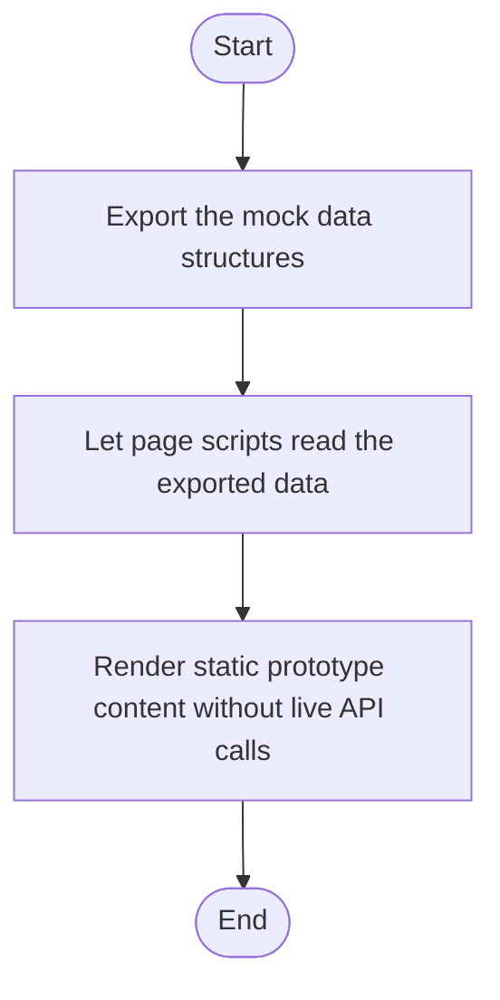

# api.js

- Source: Frontend/scripts/api.js
- Kind: JavaScript module
- Lines: 179
- Role: Supplies mock data that feeds the current frontend experience.
- Chronology: Runs in the browser while the user navigates the prototype UI.

## Notable Symbols
- This artifact is primarily declarative or inline and does not expose many named symbols.

## Direct Dependencies
- No direct dependency list was extracted from the file text.

## File Outline
### Responsibility

This file implements the mock-data contract for the current frontend. Instead of calling a live backend, the pages pull their dashboard, diff, fixes, and download content from the exported in-memory structures defined here. This script implements one piece of the frontend interaction model. It runs inside the browser after the SPA shell loads and updates the page in response to routing or user actions.

### Position In The Flow

Runs in the browser while the user navigates the prototype UI.

### Main Surface Area

Supplies mock data that feeds the current frontend experience.

## File Activity

## Documentation Note
- This markdown file is part of the generated docs/Codebase mirror.
- It was generated from the repository state on 2026-04-23 after reading the existing docs corpus and the current source tree.

