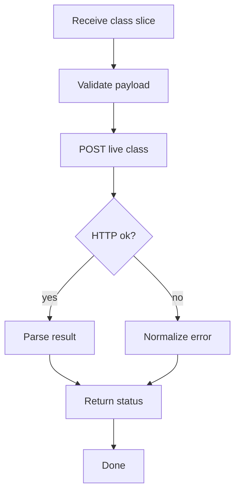

# api.js

- Source: `Frontend/scripts/api.js`
- Kind: JavaScript module

## Story
### What Happens Here

This file is the only browser-side boundary that knows backend endpoint shapes. For live class analysis, it accepts a complete class declaration from `analysis.js`, sends it to the backend, and normalizes the response for the analysis page.

The file should not contain parsing rules beyond transport validation. It should not infer design patterns, documentation tags, unit-test targets, or AI prompts.

### Why It Matters In The Flow

The frontend page should stay stable even if the backend route changes. `api.js` owns request serialization, response parsing, API errors, and version-aware result normalization.

### What To Watch While Reading

Keep live editor analysis separate from legacy file-upload transform jobs. The new path is not a transform request and should not carry old source or target pattern options.

## Program Flow



## Public Contract

Expose a function such as `analyzeClassDeclaration(payload)`.

Request fields:
- `documentId`: editor or tab identity.
- `documentVersion`: monotonically increasing input version.
- `className`: best-effort class name from the frontend boundary scan.
- `classRange`: offsets for the declaration slice.
- `code`: complete class or struct declaration text.

Response fields normalized for the page:
- `documentVersion`: response version echo.
- `accepted`: whether backend accepted the slice for analysis.
- `stage`: `lexical`, `subtree`, `cross_reference`, `ai_documentation`, or `complete`.
- `diagnostics`: lexer or parser diagnostics.
- `detectedPattern`: backend-detected pattern name, or `unknown`.
- `documentationTargets`: code parts to document.
- `unitTestTargets`: code parts to test.
- `aiDocumentation`: generated or pending documentation result.

## Endpoint

The intended endpoint is:

```text
POST /api/transform/live-class
```

This endpoint accepts JSON, not multipart file upload.

## Acceptance Checks

- `api.js` has one function for live class analysis instead of leaking route details into page scripts.
- It never sends `sourcePattern`, `targetPattern`, `sourceInput`, `sourceOutput`, or `refactorCandidate`.
- It passes `documentVersion` through unchanged so `analysis.js` can ignore stale responses.
- It treats backend diagnostics as data, not thrown exceptions, when the HTTP request itself succeeded.
