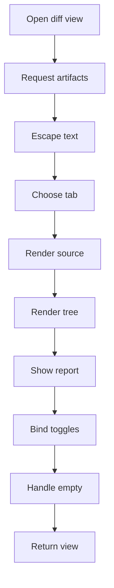
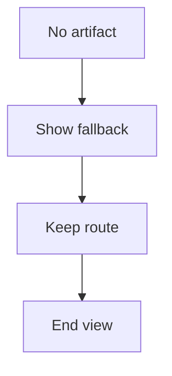
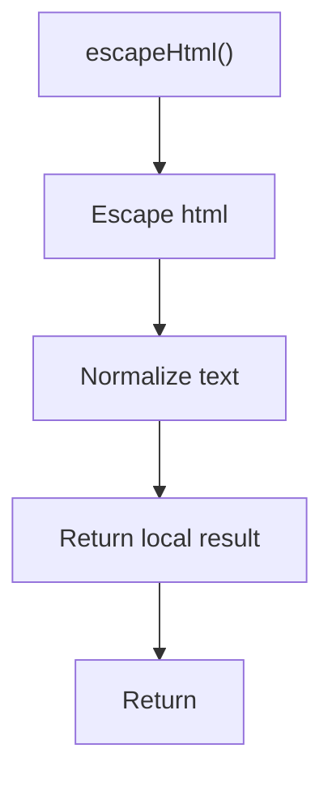
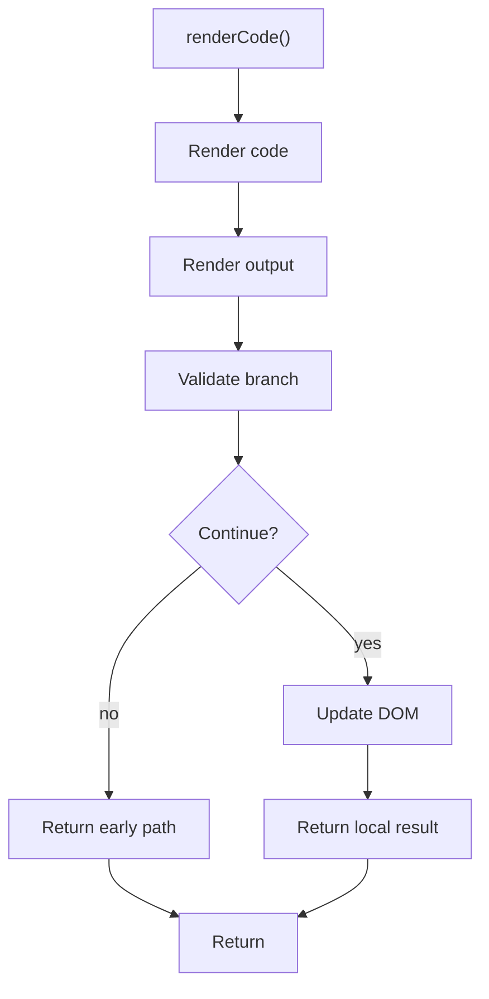

# diff-viewer.js

- Source: Frontend/scripts/diff-viewer.js
- Kind: JavaScript module

## Story
### What Happens Here

This script renders code and tree comparison artifacts returned from the backend. It may escape and format text for safe display, but the comparison data, AST output, and transformed source should come from the microservice artifact contract.

### Why It Matters In The Flow

Runs after a completed transform job when the user inspects source changes, parse-tree views, or report-backed diff output.

### What To Watch While Reading

Keep this script as a renderer. It should not compute pattern matches, rewrite source, or infer semantic changes. Those decisions must be produced by the microservice and delivered through the backend.

## Program Flow
This diagram follows the action path in plain words. Decision diamonds show where the file can stop, branch, or repeat work instead of simply passing through a straight line.

### Block 1 - Program Flow Details
#### Slice 1 - Continue Local Flow

#### Slice 2 - Continue Local Flow

## Reading Map
Read this file as: Renders source and AST artifacts returned by the backend or microservice.

Where it sits in the run: Runs after result artifacts are available.

Names worth recognizing while reading: escapeHtml, renderCode, originalLines, transformedLines, el, and cls.

## Story Groups

### Small Preparation Steps
These steps clean up names, text, or small values before the larger work begins.
- escapeHtml(): Normalize or format text values

### Showing The Result
These steps turn internal state into text, HTML, JSON, or another output a reader can inspect.
- renderCode(): Render or serialize the result, validate conditions and branch on failures, and update DOM state

## Function Stories

### escapeHtml()
This helper reshapes small pieces of data so the surrounding code can stay readable.

Inside the body, it mainly handles normalize or format text values.

The caller receives a computed result or status from this step.

What it does:
- normalize or format text values

Flow:

### renderCode()
This routine materializes internal state into an output format that later stages can consume.

Inside the body, it mainly handles render or serialize the result, validate conditions and branch on failures, and update DOM state.

It branches on runtime conditions instead of following one fixed path. The caller receives a computed result or status from this step.

What it does:
- render or serialize the result
- validate conditions and branch on failures
- update DOM state

Flow:

## Documentation Note
- This markdown file is part of the generated docs/Codebase mirror.
- It was generated from the repository state on 2026-04-23 after reading the existing docs corpus and the current source tree.
