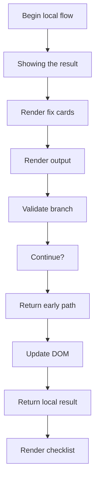
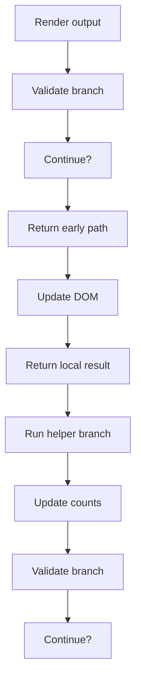
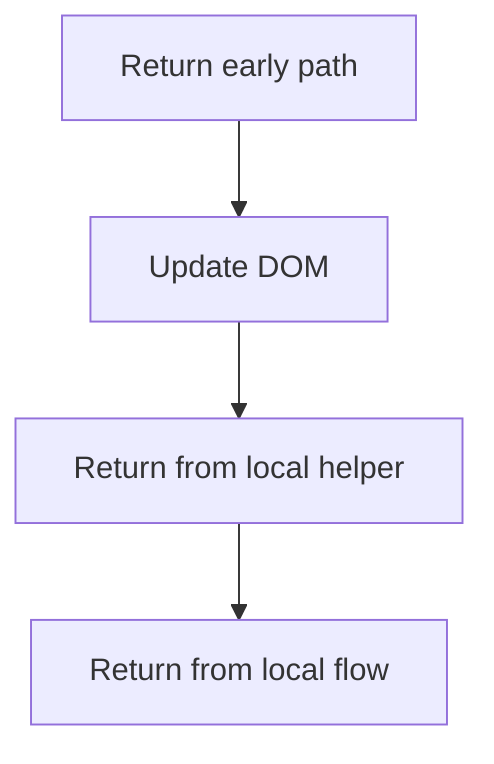
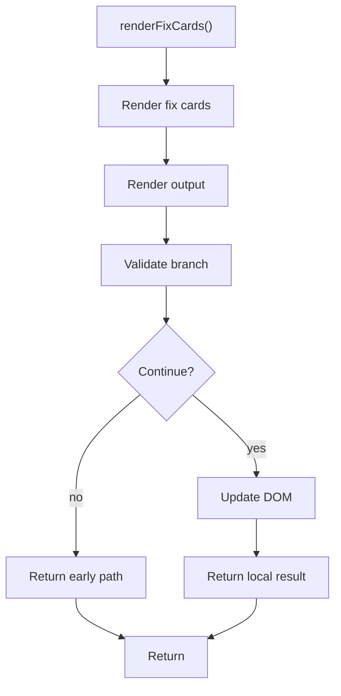
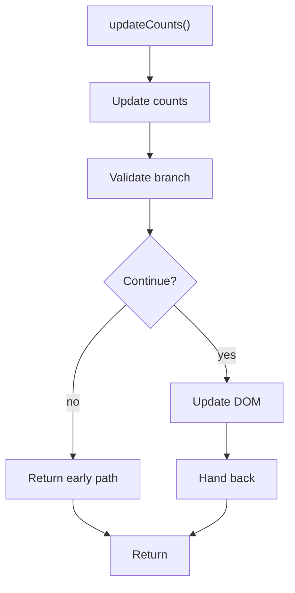

# fix-suggestions.js

- Source: Frontend/scripts/fix-suggestions.js
- Kind: JavaScript module

## Story
### What Happens Here

This script implements one piece of the frontend interaction model. It runs inside the browser after the SPA shell loads and updates the page in response to routing or user actions.

### Why It Matters In The Flow

Runs in the browser while the user navigates the prototype UI.

### What To Watch While Reading

Implements page-level interactive behavior for the static frontend. The main surface area is easiest to track through symbols such as renderFixCards, renderChecklist, updateCounts, and fixes.

## Program Flow
This diagram follows the action path in plain words. Decision diamonds show where the file can stop, branch, or repeat work instead of simply passing through a straight line.

### Block 1 - Program Flow Details
#### Slice 1 - Continue Local Flow

#### Slice 2 - Continue Local Flow

#### Slice 3 - Continue Local Flow

## Reading Map
Read this file as: Implements page-level interactive behavior for the static frontend.

Where it sits in the run: Runs in the browser while the user navigates the prototype UI.

Names worth recognizing while reading: renderFixCards, renderChecklist, updateCounts, fixes, checklist, and appliedSet.

## Story Groups

### Showing The Result
These steps turn internal state into text, HTML, JSON, or another output a reader can inspect.
- renderFixCards(): Render or serialize the result, validate conditions and branch on failures, and update DOM state
- renderChecklist(): Render or serialize the result, validate conditions and branch on failures, and update DOM state

### Supporting Steps
These steps support the local behavior of the file.
- updateCounts(): Validate conditions and branch on failures and update DOM state

## Function Stories

### renderFixCards()
This routine materializes internal state into an output format that later stages can consume.

Inside the body, it mainly handles render or serialize the result, validate conditions and branch on failures, and update DOM state.

It branches on runtime conditions instead of following one fixed path. The caller receives a computed result or status from this step.

What it does:
- render or serialize the result
- validate conditions and branch on failures
- update DOM state

Flow:

### renderChecklist()
This routine materializes internal state into an output format that later stages can consume.

Inside the body, it mainly handles render or serialize the result, validate conditions and branch on failures, and update DOM state.

It branches on runtime conditions instead of following one fixed path. The caller receives a computed result or status from this step.

What it does:
- render or serialize the result
- validate conditions and branch on failures
- update DOM state

Flow:

### updateCounts()
This routine owns one focused piece of the file's behavior.

Inside the body, it mainly handles validate conditions and branch on failures and update DOM state.

It branches on runtime conditions instead of following one fixed path.

What it does:
- validate conditions and branch on failures
- update DOM state

Flow:

## Documentation Note
- This markdown file is part of the generated docs/Codebase mirror.
- It was generated from the repository state on 2026-04-23 after reading the existing docs corpus and the current source tree.
